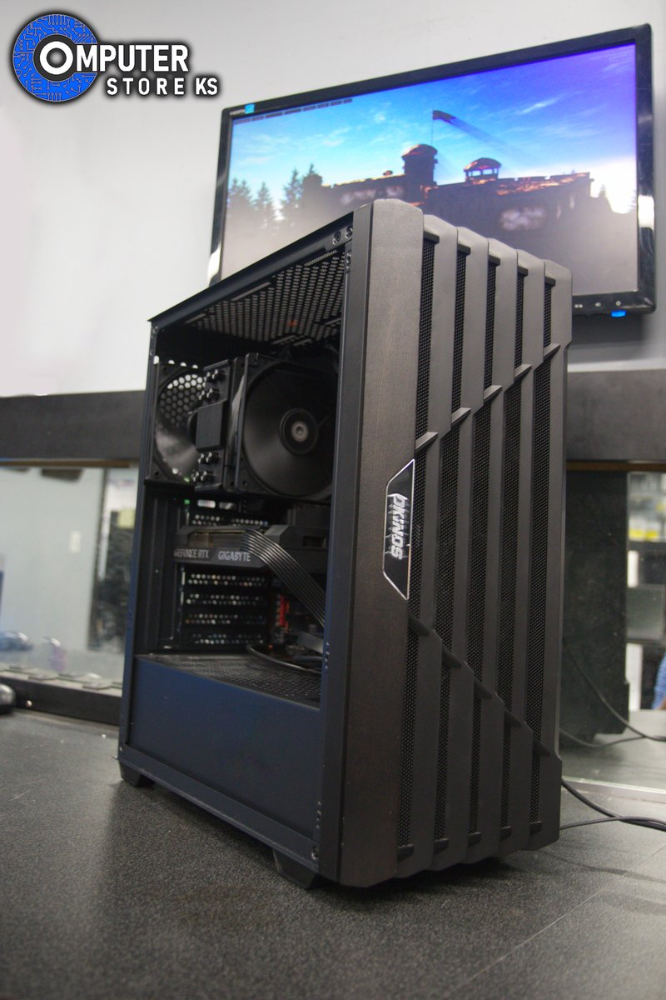

# Gallery Manager Interface Fixes

## Issues Found

The admin gallery interface wasn't working because the JavaScript was looking for the wrong HTML class names and structure.

### Problems:
1. **Wrong class selectors** - JS looked for `.card-name` but HTML has `.gallery-card-title`
2. **Wrong spec structure** - JS expected separate label/value divs, HTML has `<strong>Label:</strong> Value`
3. **Missing flip-card structure** - When saving, wasn't creating the proper flip-card HTML structure

## Fixes Applied

### 1. Fixed loadComputers() Function

**Before:**
```javascript
name: card.querySelector('.card-name')?.textContent.trim() || ''
type: card.querySelector('.card-type')?.textContent.trim().toLowerCase() || ''
price: card.querySelector('.card-price')?.textContent.trim() || ''
image: card.querySelector('.card-image')?.src || ''
```

**After:**
```javascript
name: card.querySelector('.gallery-card-title')?.textContent.trim() || ''
type: card.getAttribute('data-type') || ''
price: card.querySelector('.gallery-card-price')?.textContent.trim() || ''
image: card.querySelector('.gallery-card-image img')?.src || ''
```

**Result:** Now correctly reads computer data from the HTML ✅

### 2. Fixed Spec Parsing

**Before:**
```javascript
const specRows = card.querySelectorAll('.gallery-card-specs .spec-row');
const label = row.querySelector('.spec-label')?.textContent.trim() || '';
const value = row.querySelector('.spec-value')?.textContent.trim() || '';
```

**After:**
```javascript
const specItems = card.querySelectorAll('.gallery-card-specs .spec-item');
const fullText = item.textContent.trim();
const strong = item.querySelector('strong');
const label = strong.textContent.replace(/::?$/, '').trim();
const value = fullText.replace(strong.textContent, '').trim();
```

**Result:** Now correctly parses specs in format `<strong>Label:</strong> Value` ✅

### 3. Fixed generateHTML() for Proper Card Structure

**Before:** Generated simple flat cards

**After:** Generates proper flip-card structure:
```html
<div class="gallery-card" data-category="custom" data-computer-id="1" data-type="desktop">
  <div class="gallery-card-inner">
    <div class="gallery-card-front">
      <div class="gallery-card-badge badge-custom">Custom Build</div>
      <div class="gallery-card-image">
        
      </div>
    </div>
    <div class="gallery-card-back">
      <h3 class="gallery-card-title">Computer Name</h3>
      <div class="gallery-card-price">$1,299</div>
      <div class="gallery-card-specs">
        <div class="spec-item">
          <strong>CPU:</strong> Intel i7
        </div>
        ...
      </div>
    </div>
  </div>
</div>
```

**Result:** Published changes will maintain the flip-card animation ✅

### 4. Added Category Detection

Now detects categories from:
- `data-category` attribute (primary)
- Badge classes (fallback)
- Special handling for `badge-black-friday` (treats as refurbished)

**Result:** All categories properly recognized ✅

## What Now Works

✅ **Loading gallery** - Reads all computers from index.html
✅ **Displaying computers** - Shows cards in admin interface
✅ **Filtering** - All/Desktop/Laptop/Custom/Refurbished/New filters work
✅ **Selecting** - Click to select, double-click to edit
✅ **Modal opening** - Add/Edit modals now appear correctly
✅ **Image display** - Computer images load properly
✅ **Spec parsing** - All specifications display correctly
✅ **Publishing** - Saves with correct flip-card HTML structure

## Testing the Fixes

1. **Refresh the admin page** in your browser (Ctrl+F5)
2. **You should now see**:
   - All computers from the gallery displayed
   - Images loading properly
   - Filter buttons working
   - Click a card to select it (blue outline)
   - Double-click to edit
   - "+ Add Computer" opens modal
3. **Test editing**:
   - Double-click any computer
   - Modal should open with all data filled in
   - Make a change
   - Click Save
   - Should see toast notification
4. **Test adding**:
   - Click "+ Add Computer"
   - Fill in the form
   - Upload an image
   - Click Save
   - Computer appears in gallery

## Files Modified

- **admin-gallery.js**: Fixed all data loading and saving logic

## No Restart Required

These are frontend JavaScript changes - just refresh your browser!

---

**All issues resolved - gallery manager should now be fully functional!** 🎉
