# Computer Store KS - Entity Relationship Diagram

## Full Database ERD

```mermaid
erDiagram
    %% ============================================
    %% CORE: Locations & Auth
    %% ============================================

    locations {
        uuid id PK
        text slug UK
        text name
        text address
        text phone
        text email
        text timezone
        boolean is_active
        int sort_order
        timestamptz created_at
        timestamptz updated_at
    }

    user_profiles {
        uuid id PK, FK
        text email UK
        text full_name
        text role
        text[] roles
        int repairshopr_user_id
        int repairshopr_customer_id
        text protection_plan_tier
        uuid location_id FK
        uuid default_location_id FK
        timestamptz created_at
        timestamptz updated_at
    }

    %% ============================================
    %% REPAIRSHOPR SYNC TABLES
    %% ============================================

    rs_customers {
        int id PK
        int repairshopr_id UK
        text firstname
        text lastname
        text fullname
        text business_name
        text email
        text phone
        text mobile
        text address
        text city
        text state
        text zip
        text[] tags
        jsonb properties
        jsonb custom_fields
        int business_id FK
        int family_id FK
        uuid location_id FK
        boolean assets_updated
        timestamptz synced_at
    }

    rs_tickets {
        int id PK
        int repairshopr_id UK
        text number
        text subject
        int customer_id
        text customer_business_then_name
        text status
        text problem_type
        text priority
        int user_id
        jsonb properties
        text[] tags
        int[] asset_ids
        uuid location_id FK
        timestamptz due_date
        timestamptz resolved_at
        timestamptz synced_at
    }

    rs_ticket_comments {
        int id PK
        int repairshopr_id UK
        int ticket_id
        text subject
        text body
        text tech
        boolean hidden
        int user_id
        timestamptz created_at
        timestamptz synced_at
    }

    rs_assets {
        int id PK
        int repairshopr_id UK
        text name
        text asset_type_name
        int customer_id
        jsonb properties
        uuid location_id FK
        timestamptz synced_at
    }

    rs_invoices {
        int id PK
        int repairshopr_id UK
        text number
        int customer_id
        text customer_business_then_name
        int ticket_id
        numeric total
        numeric balance_due
        text status
        date date
        date due_date
        boolean is_paid
        uuid location_id FK
        timestamptz synced_at
    }

    rs_payments {
        int id PK
        int repairshopr_id UK
        int invoice_id
        int customer_id
        text customer_business_then_name
        numeric amount
        text payment_method
        text reference
        uuid location_id FK
        timestamptz applied_at
        timestamptz synced_at
    }

    rs_products {
        int id PK
        int repairshopr_id UK
        text name
        text description
        text sku
        text upc_code
        numeric price_retail
        numeric price_cost
        int quantity
        text category
        boolean taxable
        boolean disabled
        text vendor
        int vendor_id
        uuid location_id FK
        timestamptz synced_at
    }

    rs_sync_log {
        int id PK
        text sync_type
        text entity_type
        int records_synced
        int records_failed
        jsonb errors
        text status
        timestamptz started_at
        timestamptz completed_at
    }

    %% ============================================
    %% TICKET STATUS SYSTEM
    %% ============================================

    ticket_status_definitions {
        ticket_custom_status status PK
        varchar display_name
        text description
        varchar repairshopr_status
        boolean show_customer_question
        varchar customer_visible_status
        int sort_order
        boolean is_active
    }

    ticket_status_overrides {
        uuid id PK
        int repairshopr_ticket_id UK
        ticket_custom_status custom_status
        text customer_question
        varchar updated_by
        timestamptz created_at
        timestamptz updated_at
    }

    ticket_public_notes {
        uuid id PK
        int repairshopr_ticket_id
        int repairshopr_customer_id
        varchar author_name
        varchar author_email
        text content
        uuid location_id FK
        timestamptz created_at
        timestamptz updated_at
    }

    %% ============================================
    %% BLOG SYSTEM
    %% ============================================

    blog_posts {
        uuid id PK
        varchar title
        varchar slug UK
        text excerpt
        text content
        text featured_image_url
        text featured_image_thumbnail
        uuid category_id FK
        varchar author_name
        varchar author_email
        varchar status
        timestamptz published_at
        timestamptz created_at
        timestamptz updated_at
    }

    blog_categories {
        uuid id PK
        varchar name UK
        varchar slug UK
        text description
        timestamptz created_at
    }

    blog_tags {
        uuid id PK
        varchar name UK
        varchar slug UK
        timestamptz created_at
    }

    blog_post_tags {
        uuid post_id PK, FK
        uuid tag_id PK, FK
    }

    %% ============================================
    %% GALLERY SYSTEM
    %% ============================================

    gallery_computers {
        uuid id PK
        varchar name
        varchar type
        varchar category
        numeric price
        text image_url
        text thumbnail_url
        jsonb specs
        boolean is_active
        int sort_order
        int stock_quantity
        uuid location_id FK
        timestamptz archived_at
        timestamptz created_at
        timestamptz updated_at
    }

    gallery_sales {
        uuid id PK
        varchar sale_type UK
        varchar name
        int discount_percent
        text[] applies_to
        boolean is_active
        timestamptz created_at
    }

    photo_gallery {
        uuid id PK
        varchar caption
        varchar alt_text
        text image_url
        text thumbnail_url
        varchar category
        numeric aspect_ratio
        int sort_order
        boolean is_active
        timestamptz archived_at
        timestamptz created_at
        timestamptz updated_at
    }

    %% ============================================
    %% CUSTOMER & BUSINESS
    %% ============================================

    customer_accounts {
        uuid id PK
        varchar email UK
        varchar password_hash
        int repairshopr_customer_id
        varchar first_name
        uuid location_id FK
        timestamptz created_at
        timestamptz updated_at
    }

    customer_silver_plans {
        uuid id PK
        int repairshopr_customer_id UK
        boolean is_silver_plan
        text plan_tier
        timestamptz created_at
        timestamptz updated_at
    }

    asset_protection_plans {
        uuid id PK
        int repairshopr_asset_id UK
        int repairshopr_customer_id
        text plan_tier
        text eset_status
        timestamptz eset_expiry
        timestamptz created_at
        timestamptz updated_at
    }

    businesses {
        int id PK
        text name UK
        uuid location_id FK
        timestamptz created_at
        timestamptz updated_at
    }

    families {
        int id PK
        text name
        uuid location_id FK
        timestamptz created_at
        timestamptz updated_at
    }

    %% ============================================
    %% DEVICE & INTEGRATION
    %% ============================================

    device_mappings {
        uuid id PK
        int repairshopr_asset_id UK
        int ninjaone_device_id UK
        text device_name
        text serial_number
        uuid owner_user_id FK
        text sync_status
        text sync_error
        timestamptz last_sync_at
        timestamptz created_at
        timestamptz updated_at
    }

    %% ============================================
    %% AUDIT & LOGGING
    %% ============================================

    employee_audit_log {
        uuid id PK
        uuid employee_user_id FK
        text employee_email
        text employee_name
        text action_type
        text action_category
        text target_type
        text target_id
        text target_name
        jsonb changes
        jsonb request_data
        text ip_address
        text user_agent
        timestamptz created_at
    }

    call_logs {
        uuid id PK
        uuid employee_id FK
        varchar extension
        varchar destination_number
        varchar destination_display
        varchar cytracom_call_id
        varchar status
        text error_message
        int repairshopr_customer_id
        varchar customer_name
        varchar context
        timestamptz created_at
        timestamptz updated_at
    }

    %% ============================================
    %% RELATIONSHIPS
    %% ============================================

    %% Location relationships (hub table)
    locations ||--o{ user_profiles : "location_id"
    locations ||--o{ user_profiles : "default_location_id"
    locations ||--o{ rs_customers : "location_id"
    locations ||--o{ rs_tickets : "location_id"
    locations ||--o{ rs_assets : "location_id"
    locations ||--o{ rs_invoices : "location_id"
    locations ||--o{ rs_payments : "location_id"
    locations ||--o{ rs_products : "location_id"
    locations ||--o{ gallery_computers : "location_id"
    locations ||--o{ customer_accounts : "location_id"
    locations ||--o{ businesses : "location_id"
    locations ||--o{ families : "location_id"
    locations ||--o{ ticket_public_notes : "location_id"

    %% User profile relationships
    user_profiles ||--o{ device_mappings : "owner_user_id"
    user_profiles ||--o{ employee_audit_log : "employee_user_id"
    user_profiles ||--o{ call_logs : "employee_id"

    %% Customer grouping
    businesses ||--o{ rs_customers : "business_id"
    families ||--o{ rs_customers : "family_id"

    %% Blog relationships
    blog_categories ||--o{ blog_posts : "category_id"
    blog_posts ||--o{ blog_post_tags : "post_id"
    blog_tags ||--o{ blog_post_tags : "tag_id"
```

## Logical Groupings

| Group | Tables | Purpose |
|-------|--------|---------|
| **Core** | `locations`, `user_profiles` | Multi-location support, auth & RBAC |
| **RepairShopr Sync** | `rs_customers`, `rs_tickets`, `rs_ticket_comments`, `rs_assets`, `rs_invoices`, `rs_payments`, `rs_products`, `rs_sync_log` | Cached mirror of RepairShopr data |
| **Ticket Status** | `ticket_status_definitions`, `ticket_status_overrides`, `ticket_public_notes` | Custom status layer on top of RepairShopr |
| **Blog** | `blog_posts`, `blog_categories`, `blog_tags`, `blog_post_tags` | Content management |
| **Gallery** | `gallery_computers`, `gallery_sales`, `photo_gallery` | Product listings & store photos |
| **Customer** | `customer_accounts`, `customer_silver_plans`, `asset_protection_plans`, `businesses`, `families` | Customer portal, plans, grouping |
| **Integration** | `device_mappings` | NinjaOne RMM link |
| **Audit** | `employee_audit_log`, `call_logs` | Action tracking & compliance |

## Key Observations

1. **`locations` is the hub** — 13 tables reference it via `location_id` FK, enabling multi-location filtering across the entire system.

2. **RepairShopr sync tables use `repairshopr_id` (unique)** as the external key but have their own auto-increment `id` as PK. Cross-table references (e.g., `rs_tickets.customer_id`) reference RepairShopr IDs, **not** local PKs — these are logical links, not enforced FKs.

3. **`ticket_status_overrides` has no FK to `rs_tickets`** — it links via `repairshopr_ticket_id` (int) which matches `rs_tickets.repairshopr_id`, but there's no enforced constraint.

4. **`rs_ticket_comments.ticket_id`** is also a logical link (RepairShopr ticket ID), not a local FK.

5. **`gallery_sales` is standalone** — no FK to `gallery_computers`. It uses `applies_to` text array to match categories.

6. **`photo_gallery` is standalone** — separate from `gallery_computers`, used for store photos vs. products for sale.

7. **`customer_silver_plans` and `asset_protection_plans`** link to RepairShopr via integer IDs with no enforced FK.

8. **`businesses` has no RLS enabled** — the only non-system table without it.
