# Computer Store KS - System Architecture

This document provides comprehensive architecture documentation for the Computer Store KS website, including system diagrams, data flows, and integration patterns.

**Version:** 1.0.0
**Last Updated:** 2026-01-12
**Status:** Production

---

## Table of Contents

1. [System Architecture Overview](#1-system-architecture-overview)
2. [Application Layers](#2-application-layers)
3. [Authentication Flow](#3-authentication-flow)
4. [Data Flow Diagrams](#4-data-flow-diagrams)
5. [Integration Architecture](#5-integration-architecture)
6. [Deployment Architecture](#6-deployment-architecture)

---

## 1. System Architecture Overview

### 1.1 High-Level System Diagram

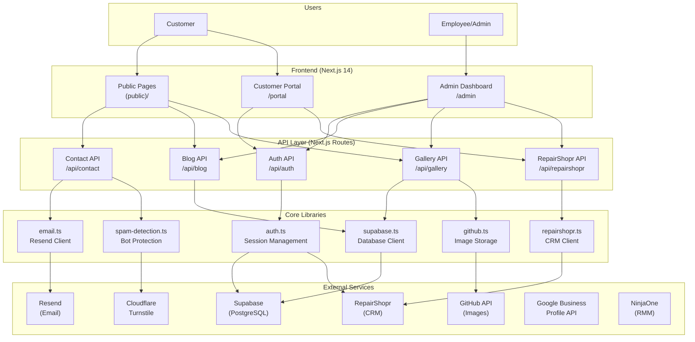

### 1.2 Component Responsibilities

| Component | Responsibility |
|-----------|---------------|
| **Public Pages** | Customer-facing website, blog, gallery, contact form |
| **Admin Dashboard** | Employee portal for CRM, tickets, blog/gallery management |
| **Customer Portal** | Ticket status, account management for customers |
| **API Layer** | RESTful endpoints for all data operations |
| **Core Libraries** | Reusable clients for external services |
| **Supabase** | Primary database, auth, and real-time features |
| **RepairShopr** | CRM system for customers, tickets, invoices |
| **GitHub** | Image storage for gallery and blog |
| **Resend** | Transactional email delivery |

---

## 2. Application Layers

### 2.1 Three-Tier Architecture

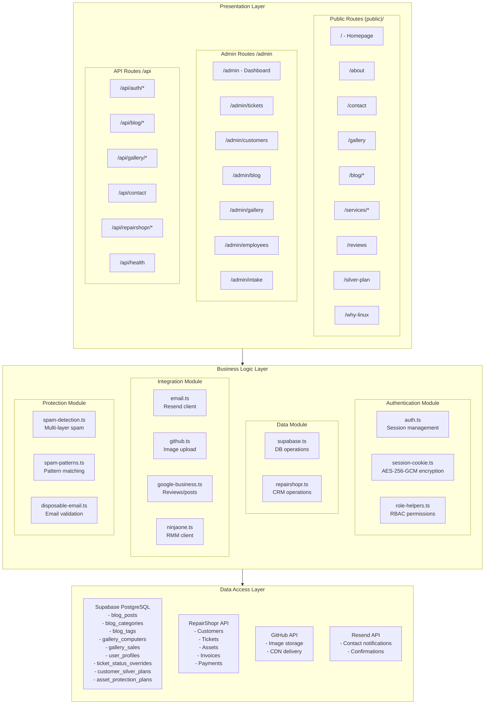

### 2.2 Directory Structure

```
src/
├── app/                          # Next.js App Router
│   ├── (public)/                 # Public route group
│   │   ├── page.tsx              # Homepage
│   │   ├── about/page.tsx
│   │   ├── blog/
│   │   │   ├── page.tsx          # Blog listing
│   │   │   └── [slug]/page.tsx   # Blog post
│   │   ├── contact/page.tsx
│   │   ├── gallery/page.tsx
│   │   ├── reviews/page.tsx
│   │   ├── services/
│   │   │   ├── page.tsx          # Services hub
│   │   │   ├── diagnostics/
│   │   │   ├── virus-removal/
│   │   │   └── [...]             # 10 service pages
│   │   ├── silver-plan/page.tsx
│   │   └── why-linux/page.tsx
│   ├── admin/                    # Admin dashboard
│   │   ├── page.tsx              # Reception dashboard
│   │   ├── blog/
│   │   ├── customers/
│   │   ├── gallery/
│   │   ├── intake/
│   │   ├── tickets/
│   │   │   ├── page.tsx          # Ticket list
│   │   │   └── [id]/page.tsx     # Ticket detail
│   │   └── employees/
│   ├── api/                      # API routes
│   │   ├── auth/
│   │   ├── blog/
│   │   ├── contact/
│   │   ├── gallery/
│   │   ├── health/
│   │   └── repairshopr/
│   ├── layout.tsx                # Root layout
│   └── middleware.ts             # Auth/security middleware
├── components/
│   ├── admin/                    # Admin UI components
│   ├── gallery/                  # Gallery components
│   └── static/                   # Header, Footer, etc.
├── lib/                          # Core libraries
│   ├── auth.ts                   # Session management
│   ├── supabase.ts               # Database client
│   ├── repairshopr.ts            # CRM client
│   ├── email.ts                  # Email client
│   ├── github.ts                 # Image storage
│   ├── google-business.ts        # GBP integration
│   ├── ninjaone.ts               # RMM integration
│   ├── spam-detection.ts         # Bot protection
│   └── role-helpers.ts           # RBAC utilities
├── types/                        # TypeScript types
└── styles/                       # CSS/Tailwind
```

---

## 3. Authentication Flow

### 3.1 Authentication Sequence Diagram

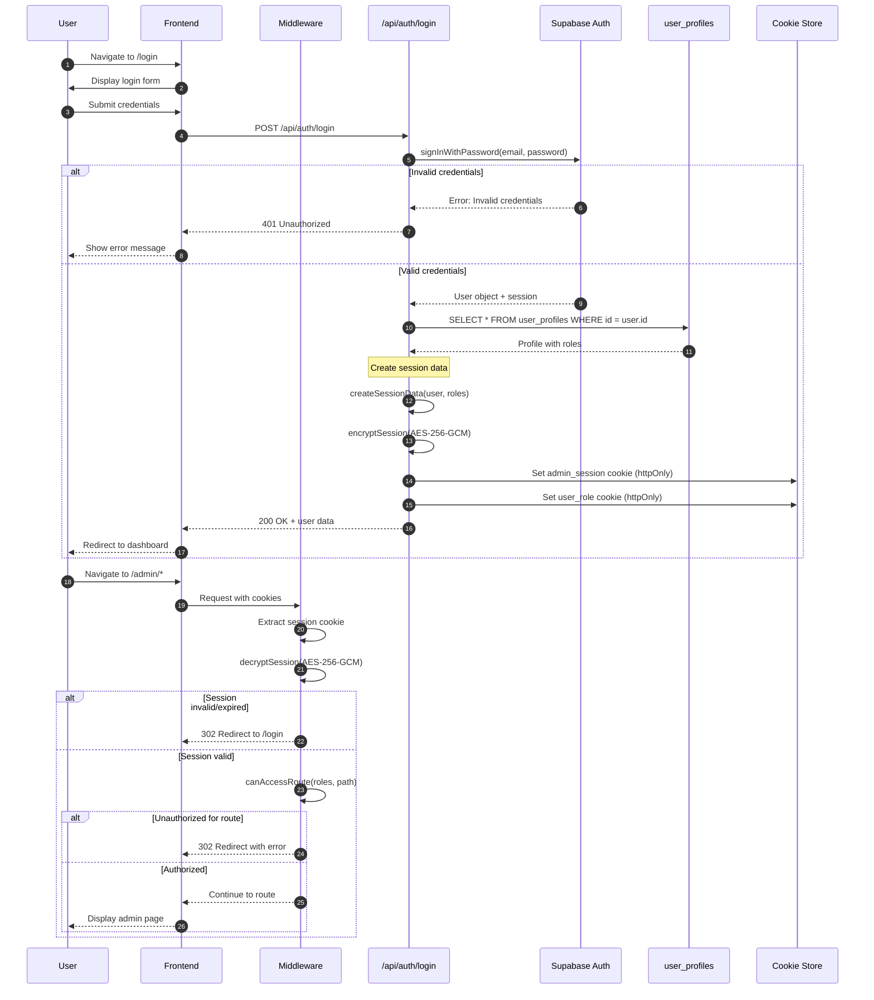

### 3.2 Session Cookie Encryption

The system uses **AES-256-GCM** encryption for session cookies:

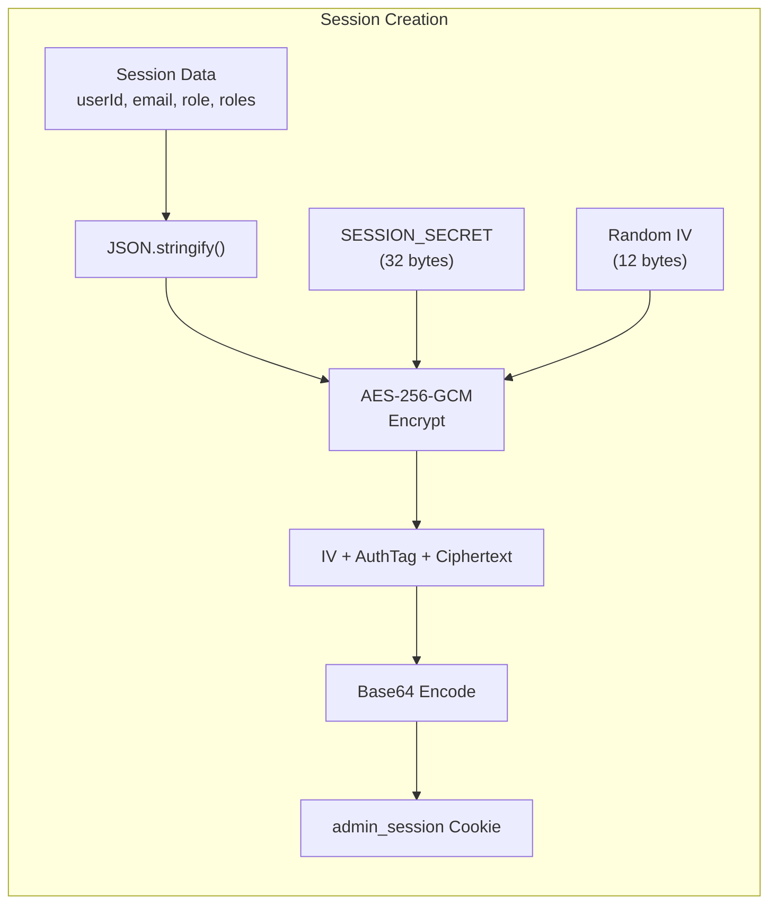

**Session Data Structure:**

```typescript
interface SessionData {
  userId: number;           // RepairShopr user/customer ID
  supabaseUserId: string;   // Supabase auth.users UUID
  email: string;
  name: string;
  role: 'admin' | 'employee' | 'limited';
  roles: string[];          // Multi-role array
  userType: 'employee' | 'customer';
  location_id: string | null;
  apiToken?: string;        // Deprecated: RepairShopr token
  expiresAt: number;        // Unix timestamp
}
```

### 3.3 Role-Based Access Control

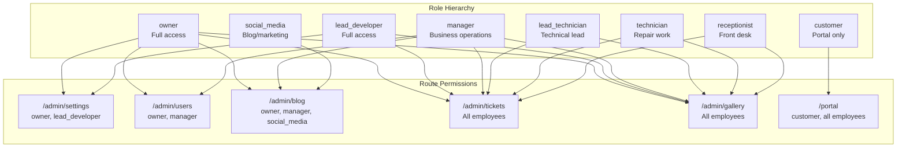

---

## 4. Data Flow Diagrams

### 4.1 Blog System Data Flow

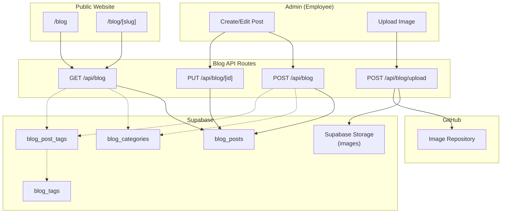

**Blog Tables Schema:**

| Table | Purpose |
|-------|---------|
| `blog_posts` | Main posts with title, slug, content, status |
| `blog_categories` | Categories for posts |
| `blog_tags` | Tags for posts |
| `blog_post_tags` | Many-to-many junction table |

### 4.2 Gallery System Data Flow

```mermaid
flowchart TB
    subgraph Admin["Admin"]
        AddComputer["Add Computer"]
        EditComputer["Edit Computer"]
        UploadImage["Upload Image"]
        SetSale["Set Active Sale"]
    end

    subgraph GalleryAPI["Gallery API"]
        PostGallery["POST /api/gallery"]
        PutGallery["PUT /api/gallery/[id]"]
        UploadGalleryAPI["POST /api/gallery/upload"]
        SaleAPI["POST /api/gallery/sale"]
    end

    subgraph Supabase["Supabase"]
        Computers["gallery_computers"]
        Sales["gallery_sales"]
    end

    subgraph GitHub["GitHub"]
        ImageRepo["Computer Images<br/>public/images/gallery"]
    end

    subgraph Public["Public Website"]
        GalleryPage["/gallery"]
    end

    AddComputer --> PostGallery
    EditComputer --> PutGallery
    UploadImage --> UploadGalleryAPI
    SetSale --> SaleAPI

    PostGallery --> Computers
    PutGallery --> Computers
    UploadGalleryAPI --> ImageRepo
    SaleAPI --> Sales

    GalleryPage --> Computers
    GalleryPage --> Sales

    Note over GalleryPage: "Sale pricing applied<br/>at query time"
```

**Gallery Tables Schema:**

| Table | Fields |
|-------|--------|
| `gallery_computers` | id, name, type, category, price, image_url, specs[], is_active |
| `gallery_sales` | id, sale_type, name, discount_percent, applies_to[], is_active |

### 4.3 Ticket Management Data Flow

```mermaid
flowchart TB
    subgraph Employee["Employee Portal"]
        ViewTickets["View Tickets"]
        UpdateStatus["Update Custom Status"]
        AddNote["Add Note"]
    end

    subgraph TicketAPI["Ticket API Routes"]
        SearchTickets["GET /api/repairshopr/tickets"]
        GetTicket["GET /api/repairshopr/tickets/[id]"]
        UpdateTicket["PUT /api/repairshopr/tickets/[id]"]
        StatusAPI["POST /api/repairshopr/tickets/status/[id]"]
        NotesAPI["POST /api/repairshopr/tickets/[id]/notes"]
    end

    subgraph RepairShopr["RepairShopr CRM"]
        RSTickets["Tickets"]
        RSCustomers["Customers"]
        RSAssets["Assets"]
    end

    subgraph Supabase["Supabase"]
        StatusOverrides["ticket_status_overrides"]
        StatusDefs["ticket_status_definitions"]
        PublicNotes["ticket_public_notes"]
    end

    ViewTickets --> SearchTickets
    ViewTickets --> GetTicket
    UpdateStatus --> StatusAPI
    AddNote --> NotesAPI

    SearchTickets --> RSTickets
    GetTicket --> RSTickets
    GetTicket --> RSCustomers
    UpdateTicket --> RSTickets

    StatusAPI --> StatusOverrides
    StatusAPI -.-> StatusDefs

    NotesAPI --> RSTickets
    NotesAPI --> PublicNotes

    Note over StatusOverrides: "Custom status layer<br/>on top of RS status"
```

**Custom Status System:**

The system maintains custom ticket statuses on top of RepairShopr:

| Custom Status | Display Name | RS Status | Customer Visible |
|--------------|--------------|-----------|-----------------|
| new | New | New | Received |
| diagnosing | Diagnosing | In Progress | Being Diagnosed |
| repairing | Repairing | In Progress | Being Repaired |
| waiting_for_parts | Waiting for Parts | Waiting for Parts | Waiting for Parts |
| call_customer | Call Customer | Customer Reply | We Have a Question |
| ready_for_pickup | Ready for Pickup | Done Shelf | Ready for Pickup |
| completed | Completed | Resolved | Completed |

### 4.4 Contact Form Submission Flow

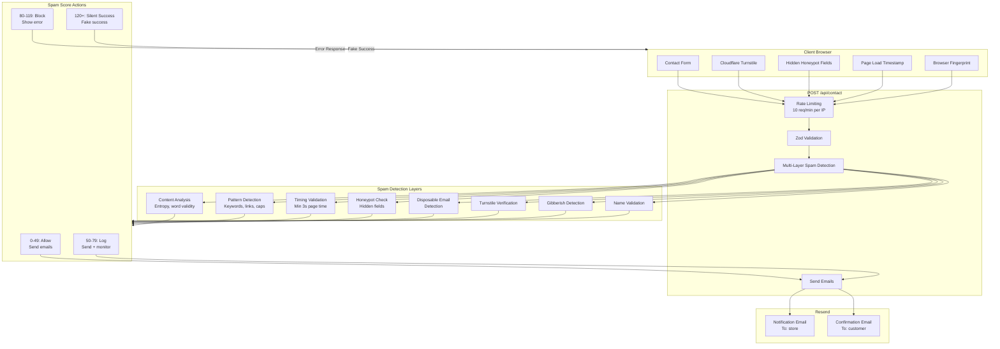

### 4.5 Customer/Family Management Data Flow

```mermaid
flowchart TB
    subgraph Employee["Employee Portal"]
        SearchCustomer["Search Customer"]
        ViewCustomer["View Customer Details"]
        CreateCustomer["Create Customer"]
        ManageAssets["Manage Assets"]
        SetProtection["Set Protection Plan"]
    end

    subgraph CustomerAPI["Customer API Routes"]
        SearchAPI["GET /api/repairshopr/customers?q="]
        GetAPI["GET /api/repairshopr/customers/[id]"]
        CreateAPI["POST /api/repairshopr/customers"]
        AssetsAPI["GET/POST /api/repairshopr/customers/[id]/assets"]
        ProtectionAPI["POST /api/repairshopr/customers/[id]/protection"]
    end

    subgraph RepairShopr["RepairShopr"]
        RSCustomers["Customers"]
        RSAssets["Customer Assets"]
    end

    subgraph Supabase["Supabase"]
        CustomerPlans["customer_silver_plans"]
        AssetPlans["asset_protection_plans"]
        RSSync["rs_customers<br/>(synced data)"]
    end

    SearchCustomer --> SearchAPI
    ViewCustomer --> GetAPI
    CreateCustomer --> CreateAPI
    ManageAssets --> AssetsAPI
    SetProtection --> ProtectionAPI

    SearchAPI --> RSCustomers
    GetAPI --> RSCustomers
    GetAPI --> RSAssets
    CreateAPI --> RSCustomers
    AssetsAPI --> RSAssets

    GetAPI --> CustomerPlans
    GetAPI --> AssetPlans
    ProtectionAPI --> CustomerPlans
    ProtectionAPI --> AssetPlans

    RSCustomers --> RSSync

    Note over AssetPlans: "Per-asset protection<br/>eset, silver, silver-plus"
```

**Protection Plan Tiers:**

| Tier | Description |
|------|-------------|
| `eset` | Basic ESET antivirus only |
| `silver` | Silver protection plan |
| `silver-plus` | Silver+ premium plan |

---

## 5. Integration Architecture

### 5.1 RepairShopr CRM Integration

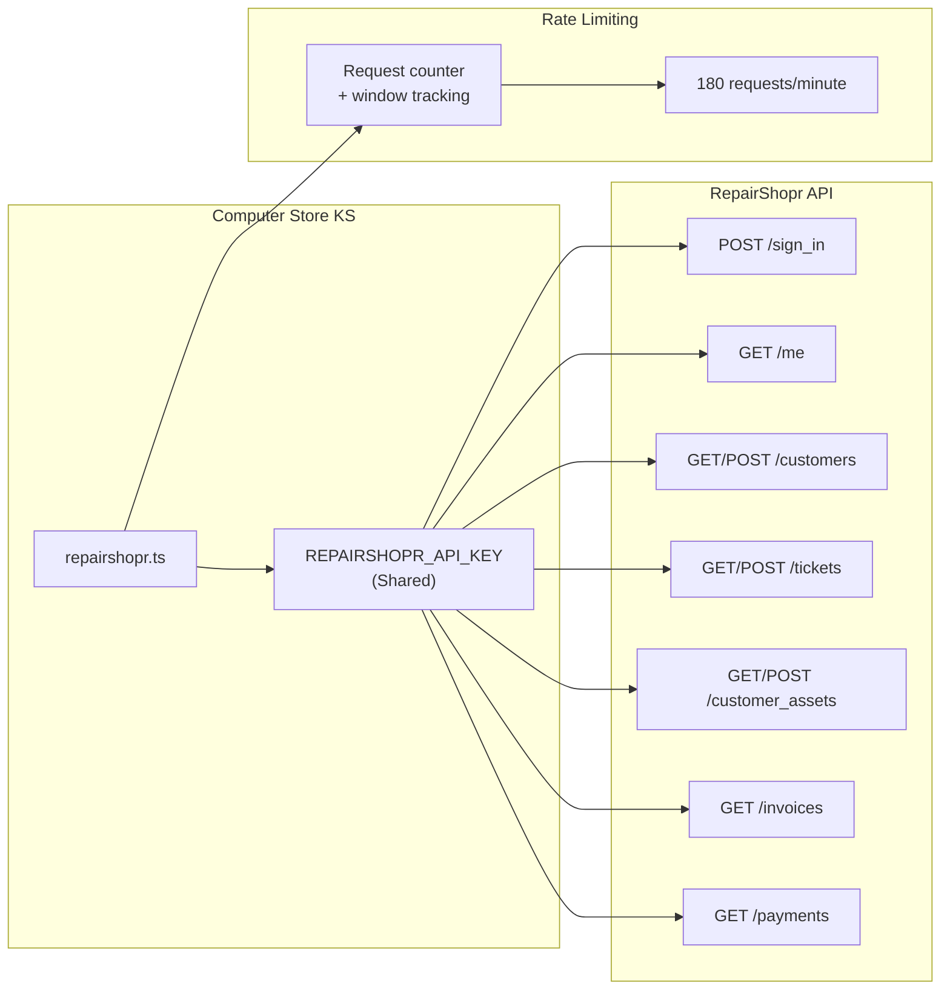

**RepairShopr Client Features:**

- **Rate Limiting:** 180 requests per minute with automatic tracking
- **Error Handling:** Custom `RepairShoprAPIError` with status codes
- **Shared API Key:** Single key for all operations (audit via Supabase)
- **Type Safety:** Full TypeScript interfaces for all entities

### 5.2 NinjaOne RMM Integration

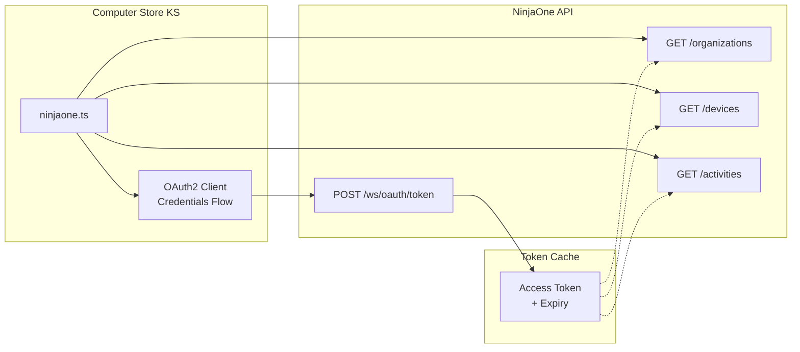

### 5.3 Supabase Database Integration

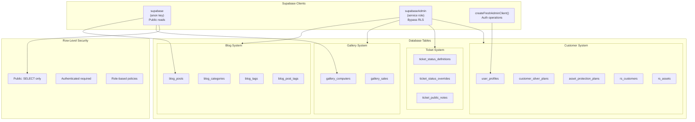

### 5.4 GitHub Image Storage Integration

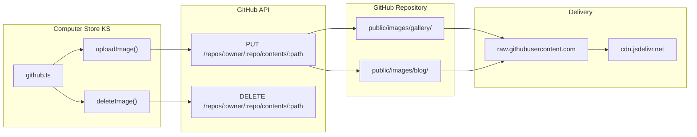

### 5.5 Email Service Integration (Resend)

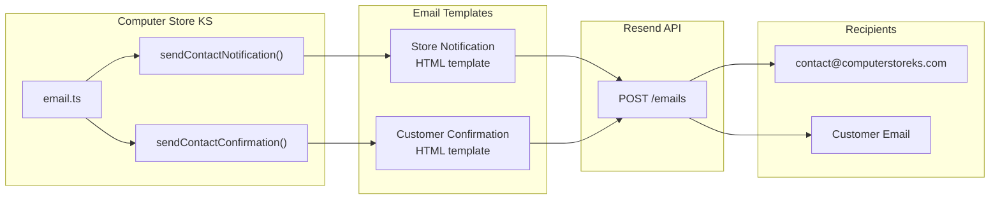

### 5.6 Google Business Profile Integration

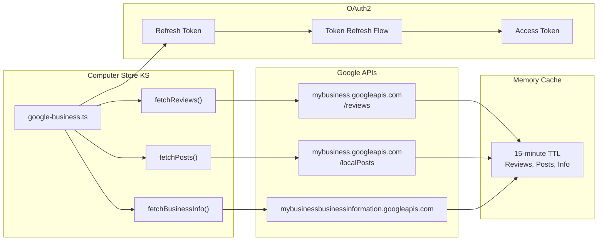

### 5.7 Cloudflare Turnstile Integration

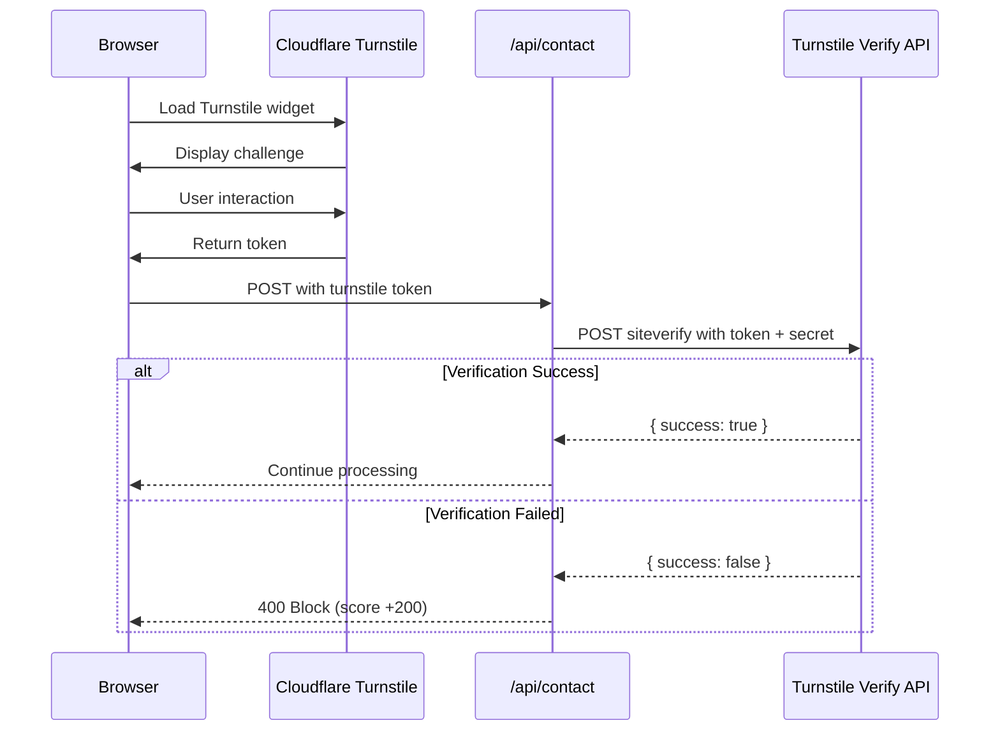

---

## 6. Deployment Architecture

### 6.1 Render Deployment Diagram

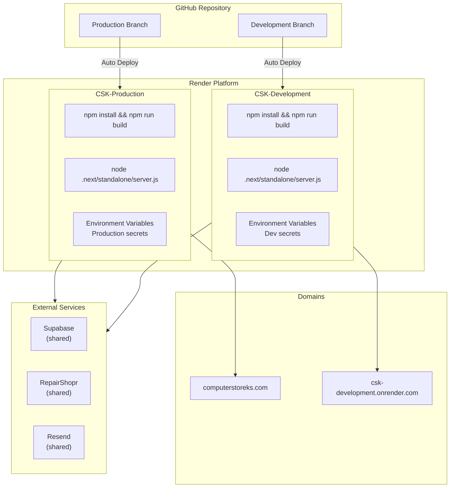

### 6.2 Branch Strategy

```mermaid
gitgraph
    commit id: "Initial"
    branch Development
    checkout Development
    commit id: "Feature A"
    commit id: "Feature B"
    commit id: "Bug Fix"
    checkout main
    merge Development id: "Release v1.0" tag: "Production"
    checkout Development
    commit id: "Feature C"
    commit id: "Feature D"
    checkout main
    merge Development id: "Release v1.1" tag: "Production"
```

**Branch Rules:**

| Branch | Purpose | Deployment |
|--------|---------|------------|
| `Production` | Live site | computerstoreks.com |
| `Development` | Testing/staging | csk-development.onrender.com |

**Workflow:**

1. All work done in `Development` branch
2. Test thoroughly on dev deployment
3. Merge to `Production` for live release
4. Render auto-deploys from both branches

### 6.3 CI/CD Flow

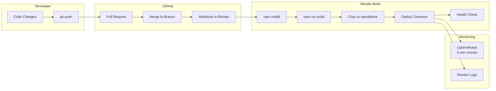

### 6.4 Environment Configuration

```mermaid
flowchart TB
    subgraph Required["Required Variables"]
        Supabase["NEXT_PUBLIC_SUPABASE_URL<br/>NEXT_PUBLIC_SUPABASE_ANON_KEY<br/>SUPABASE_SERVICE_ROLE_KEY"]
        Auth["SESSION_SECRET<br/>REPAIRSHOPR_SUBDOMAIN<br/>REPAIRSHOPR_API_KEY"]
        Email["RESEND_API_KEY<br/>NOTIFICATION_EMAIL"]
    end

    subgraph Optional["Optional Variables"]
        GitHub["GITHUB_TOKEN<br/>GITHUB_OWNER<br/>GITHUB_REPO"]
        Turnstile["TURNSTILE_SITE_KEY<br/>TURNSTILE_SECRET_KEY"]
        Google["GOOGLE_BUSINESS_*"]
        NinjaOne["NINJAONE_*"]
    end

    subgraph Runtime["Runtime Config"]
        NodeEnv["NODE_ENV=production"]
        Port["PORT=3000"]
        Hostname["HOSTNAME=0.0.0.0"]
        NodeVersion["NODE_VERSION=20.11.0"]
    end
```

---

## Summary

This architecture documentation covers:

1. **System Overview** - High-level component diagram showing all integrations
2. **Application Layers** - Three-tier architecture with presentation, business logic, and data access
3. **Authentication** - Dual-mode auth (Supabase + RepairShopr legacy) with AES-256-GCM session encryption
4. **Data Flows** - Detailed flows for blog, gallery, tickets, contacts, and customer management
5. **Integrations** - RepairShopr CRM, NinjaOne RMM, Supabase, GitHub, Resend, Google Business, Turnstile
6. **Deployment** - Render dual-environment setup with Production/Development branches

For additional details, see:
- `CLAUDE.md` - Project overview and development guide
- `docs/database/` - Database schema documentation
- `.env.example` - Environment variable reference
