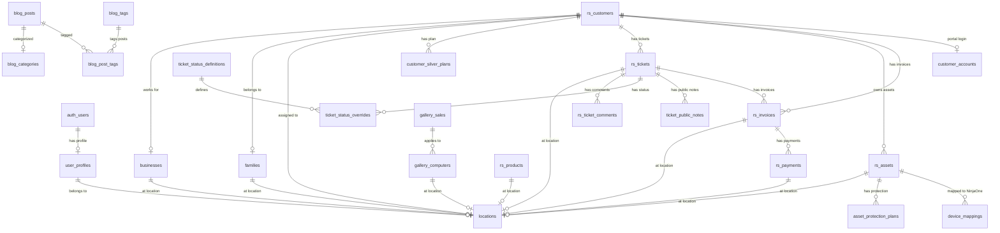

# Computer Store KS Database Schema

## 1. Overview

### Database Platform
- **Database**: Supabase (PostgreSQL)
- **Connection**: Via Supabase client libraries
- **Extensions**: `uuid-ossp` for UUID generation

### Connection Configuration

```typescript
// Public client (anon key) - for public read operations
const supabase = createClient(
  process.env.NEXT_PUBLIC_SUPABASE_URL,
  process.env.NEXT_PUBLIC_SUPABASE_ANON_KEY
);

// Admin client (service role key) - bypasses RLS for admin operations
const supabaseAdmin = createClient(
  process.env.NEXT_PUBLIC_SUPABASE_URL,
  process.env.SUPABASE_SERVICE_ROLE_KEY,
  { auth: { autoRefreshToken: false, persistSession: false } }
);
```

### Row-Level Security (RLS)
All tables have RLS enabled with policies for:
- **Public access**: Read-only for published/active content
- **Authenticated access**: Based on user roles (customer, staff, admin)
- **Service role access**: Full access for backend operations (bypasses RLS)

---

## 2. Entity Relationship Diagram



---

## 3. Tables by Domain

### 3.1 User & Authentication Tables

#### `user_profiles`
Links Supabase Auth users to RepairShopr and stores role/permissions.

| Column | Type | Constraints | Default | Description |
|--------|------|-------------|---------|-------------|
| `id` | UUID | PK, FK(auth.users) | - | References Supabase Auth user |
| `email` | TEXT | UNIQUE, NOT NULL | - | User email address |
| `full_name` | TEXT | - | NULL | Display name |
| `role` | TEXT | NOT NULL, CHECK | 'customer' | Legacy role: admin, technician, receptionist, customer |
| `roles` | TEXT[] | NOT NULL, CHECK | ['customer'] | Array of roles for RBAC |
| `repairshopr_user_id` | INTEGER | - | NULL | RepairShopr user ID (employees) |
| `repairshopr_customer_id` | INTEGER | - | NULL | RepairShopr customer ID |
| `protection_plan_tier` | TEXT | CHECK | NULL | bronze, silver, gold (deprecated) |
| `location_id` | UUID | FK(locations) | NULL | Assigned business location |
| `created_at` | TIMESTAMPTZ | NOT NULL | NOW() | Record creation time |
| `updated_at` | TIMESTAMPTZ | NOT NULL | NOW() | Last modification time |

**Valid roles array values**: `receptionist`, `technician`, `lead_technician`, `manager`, `owner`, `social_media`, `lead_developer`, `customer`

#### `customer_accounts`
Customer portal login credentials separate from Supabase Auth.

| Column | Type | Constraints | Default | Description |
|--------|------|-------------|---------|-------------|
| `id` | UUID | PK | gen_random_uuid() | Primary key |
| `email` | VARCHAR(255) | UNIQUE, NOT NULL | - | Login email |
| `password_hash` | VARCHAR(255) | NOT NULL | - | bcrypt hashed password |
| `repairshopr_customer_id` | INTEGER | NOT NULL | - | RepairShopr customer link |
| `first_name` | VARCHAR(100) | - | NULL | Customer first name |
| `location_id` | UUID | FK(locations) | NULL | Customer's location |
| `created_at` | TIMESTAMPTZ | - | NOW() | - |
| `updated_at` | TIMESTAMPTZ | - | NOW() | - |

#### `locations`
Multi-location support for business locations.

| Column | Type | Constraints | Default | Description |
|--------|------|-------------|---------|-------------|
| `id` | UUID | PK | gen_random_uuid() | Primary key |
| `slug` | TEXT | UNIQUE, NOT NULL | - | URL-friendly identifier |
| `name` | TEXT | NOT NULL | - | Display name |
| `address` | TEXT | - | NULL | Full address |
| `phone` | TEXT | - | NULL | Phone number |
| `email` | TEXT | - | NULL | Contact email |
| `timezone` | TEXT | - | 'America/Chicago' | Location timezone |
| `is_active` | BOOLEAN | - | true | Whether location is operational |
| `sort_order` | INTEGER | - | 0 | Display ordering |
| `created_at` | TIMESTAMPTZ | - | NOW() | - |
| `updated_at` | TIMESTAMPTZ | - | NOW() | - |

**Initial locations**: Topeka (active, primary), Holton (for expansion)

---

### 3.2 RepairShopr Sync Tables

These tables mirror data from RepairShopr for faster queries and eventual migration.

#### `rs_customers`
Synced customer data from RepairShopr.

| Column | Type | Constraints | Default | Description |
|--------|------|-------------|---------|-------------|
| `id` | SERIAL | PK | - | Internal ID |
| `repairshopr_id` | INTEGER | UNIQUE, NOT NULL | - | RepairShopr customer ID |
| `firstname` | TEXT | - | NULL | First name |
| `lastname` | TEXT | - | NULL | Last name |
| `fullname` | TEXT | - | NULL | Full name |
| `business_name` | TEXT | - | NULL | Business name |
| `email` | TEXT | - | NULL | Email address |
| `phone` | TEXT | - | NULL | Phone number |
| `mobile` | TEXT | - | NULL | Mobile number |
| `address` | TEXT | - | NULL | Address line 1 |
| `address_2` | TEXT | - | NULL | Address line 2 |
| `city` | TEXT | - | NULL | City |
| `state` | TEXT | - | NULL | State |
| `zip` | TEXT | - | NULL | ZIP code |
| `tags` | TEXT[] | - | NULL | Customer tags |
| `properties` | JSONB | - | NULL | Custom fields |
| `custom_fields` | JSONB | - | NULL | Custom field data |
| `business_id` | INTEGER | FK(businesses) | NULL | Linked business entity |
| `family_id` | INTEGER | FK(families) | NULL | Linked family group |
| `location_id` | UUID | FK(locations) | NULL | Assigned location |
| `assets_updated` | BOOLEAN | - | FALSE | Migration flag for asset-level plans |
| `created_at` | TIMESTAMPTZ | - | NULL | RepairShopr creation time |
| `updated_at` | TIMESTAMPTZ | - | NULL | RepairShopr update time |
| `synced_at` | TIMESTAMPTZ | - | NOW() | Last sync time |

#### `rs_tickets`
Synced ticket/work order data from RepairShopr.

| Column | Type | Constraints | Default | Description |
|--------|------|-------------|---------|-------------|
| `id` | SERIAL | PK | - | Internal ID |
| `repairshopr_id` | INTEGER | UNIQUE, NOT NULL | - | RepairShopr ticket ID |
| `number` | TEXT | - | NULL | Ticket number |
| `subject` | TEXT | - | NULL | Ticket subject |
| `customer_id` | INTEGER | - | NULL | RepairShopr customer ID |
| `customer_business_then_name` | TEXT | - | NULL | Display name |
| `status` | TEXT | - | NULL | RepairShopr status |
| `problem_type` | TEXT | - | NULL | Issue category |
| `priority` | TEXT | - | NULL | Priority level |
| `due_date` | TIMESTAMPTZ | - | NULL | Due date |
| `resolved_at` | TIMESTAMPTZ | - | NULL | Resolution time |
| `user_id` | INTEGER | - | NULL | Assigned technician |
| `properties` | JSONB | - | NULL | Custom fields |
| `tags` | TEXT[] | - | NULL | Ticket tags |
| `location_id` | UUID | FK(locations) | NULL | Location |
| `created_at` | TIMESTAMPTZ | - | NULL | Creation time |
| `updated_at` | TIMESTAMPTZ | - | NULL | Update time |
| `synced_at` | TIMESTAMPTZ | - | NOW() | Last sync |

#### `rs_ticket_comments`
Synced ticket comments from RepairShopr.

| Column | Type | Constraints | Default | Description |
|--------|------|-------------|---------|-------------|
| `id` | SERIAL | PK | - | Internal ID |
| `repairshopr_id` | INTEGER | UNIQUE, NOT NULL | - | RepairShopr comment ID |
| `ticket_id` | INTEGER | - | NULL | RepairShopr ticket ID |
| `subject` | TEXT | - | NULL | Comment subject |
| `body` | TEXT | - | NULL | Comment content |
| `tech` | TEXT | - | NULL | Technician name |
| `hidden` | BOOLEAN | - | FALSE | True = private/internal |
| `user_id` | INTEGER | - | NULL | Author user ID |
| `created_at` | TIMESTAMPTZ | - | NULL | - |
| `updated_at` | TIMESTAMPTZ | - | NULL | - |
| `synced_at` | TIMESTAMPTZ | - | NOW() | - |

#### `rs_assets`
Synced customer devices/assets from RepairShopr.

| Column | Type | Constraints | Default | Description |
|--------|------|-------------|---------|-------------|
| `id` | SERIAL | PK | - | Internal ID |
| `repairshopr_id` | INTEGER | UNIQUE, NOT NULL | - | RepairShopr asset ID |
| `name` | TEXT | - | NULL | Asset name |
| `asset_type_name` | TEXT | - | NULL | Asset type |
| `customer_id` | INTEGER | - | NULL | Owner customer ID |
| `properties` | JSONB | - | NULL | Custom properties |
| `location_id` | UUID | FK(locations) | NULL | Location |
| `created_at` | TIMESTAMPTZ | - | NULL | - |
| `updated_at` | TIMESTAMPTZ | - | NULL | - |
| `synced_at` | TIMESTAMPTZ | - | NOW() | - |

#### `rs_invoices`
Synced invoices from RepairShopr.

| Column | Type | Constraints | Default | Description |
|--------|------|-------------|---------|-------------|
| `id` | SERIAL | PK | - | Internal ID |
| `repairshopr_id` | INTEGER | UNIQUE, NOT NULL | - | RepairShopr invoice ID |
| `number` | TEXT | - | NULL | Invoice number |
| `customer_id` | INTEGER | - | NULL | Customer ID |
| `customer_business_then_name` | TEXT | - | NULL | Customer display name |
| `ticket_id` | INTEGER | - | NULL | Related ticket ID |
| `total` | DECIMAL(10,2) | - | NULL | Total amount |
| `balance_due` | DECIMAL(10,2) | - | NULL | Amount remaining |
| `status` | TEXT | - | NULL | Invoice status |
| `date` | DATE | - | NULL | Invoice date |
| `due_date` | DATE | - | NULL | Due date |
| `po_number` | TEXT | - | NULL | Purchase order |
| `note` | TEXT | - | NULL | Notes |
| `is_paid` | BOOLEAN | - | FALSE | Payment status |
| `location_id` | UUID | FK(locations) | NULL | Location |
| `created_at` | TIMESTAMPTZ | - | NULL | - |
| `updated_at` | TIMESTAMPTZ | - | NULL | - |
| `synced_at` | TIMESTAMPTZ | - | NOW() | - |

#### `rs_payments`
Synced payments from RepairShopr.

| Column | Type | Constraints | Default | Description |
|--------|------|-------------|---------|-------------|
| `id` | SERIAL | PK | - | Internal ID |
| `repairshopr_id` | INTEGER | UNIQUE, NOT NULL | - | RepairShopr payment ID |
| `invoice_id` | INTEGER | - | NULL | Related invoice ID |
| `customer_id` | INTEGER | - | NULL | Customer ID |
| `customer_business_then_name` | TEXT | - | NULL | Customer name |
| `amount` | DECIMAL(10,2) | - | NULL | Payment amount |
| `payment_method` | TEXT | - | NULL | Method (cash, card, etc) |
| `reference` | TEXT | - | NULL | Reference number |
| `applied_at` | TIMESTAMPTZ | - | NULL | Application time |
| `location_id` | UUID | FK(locations) | NULL | Location |
| `created_at` | TIMESTAMPTZ | - | NULL | - |
| `updated_at` | TIMESTAMPTZ | - | NULL | - |
| `synced_at` | TIMESTAMPTZ | - | NOW() | - |

#### `rs_products`
Synced product/inventory data from RepairShopr.

| Column | Type | Constraints | Default | Description |
|--------|------|-------------|---------|-------------|
| `id` | SERIAL | PK | - | Internal ID |
| `repairshopr_id` | INTEGER | UNIQUE, NOT NULL | - | RepairShopr product ID |
| `name` | TEXT | NOT NULL | - | Product name |
| `description` | TEXT | - | NULL | Description |
| `sku` | TEXT | - | NULL | SKU |
| `upc_code` | TEXT | - | NULL | UPC code |
| `price_retail` | DECIMAL(10,2) | - | NULL | Retail price |
| `price_cost` | DECIMAL(10,2) | - | NULL | Cost price |
| `quantity` | INTEGER | - | 0 | Stock quantity |
| `quantity_minimum` | INTEGER | - | NULL | Reorder point |
| `category` | TEXT | - | NULL | Product category |
| `taxable` | BOOLEAN | - | FALSE | Tax applicable |
| `disabled` | BOOLEAN | - | FALSE | Disabled status |
| `notes` | TEXT | - | NULL | Notes |
| `location` | TEXT | - | NULL | Stock location |
| `rs_location_id` | INTEGER | - | NULL | RepairShopr location ID |
| `vendor` | TEXT | - | NULL | Vendor name |
| `vendor_id` | INTEGER | - | NULL | Vendor ID |
| `location_id` | UUID | FK(locations) | NULL | Our location |
| `created_at` | TIMESTAMPTZ | - | NULL | - |
| `updated_at` | TIMESTAMPTZ | - | NULL | - |
| `synced_at` | TIMESTAMPTZ | - | NOW() | - |

#### `rs_sync_log`
Tracks RepairShopr sync operations for monitoring.

| Column | Type | Constraints | Default | Description |
|--------|------|-------------|---------|-------------|
| `id` | SERIAL | PK | - | Internal ID |
| `sync_type` | TEXT | NOT NULL | - | 'full', 'incremental', 'entity' |
| `entity_type` | TEXT | - | NULL | Table being synced |
| `started_at` | TIMESTAMPTZ | - | NOW() | Start time |
| `completed_at` | TIMESTAMPTZ | - | NULL | End time |
| `records_synced` | INTEGER | - | 0 | Success count |
| `records_failed` | INTEGER | - | 0 | Failure count |
| `errors` | JSONB | - | NULL | Error details |
| `status` | TEXT | - | 'running' | running, completed, failed |

---

### 3.3 Ticket Status Tables

#### `ticket_status_definitions`
Reference table defining custom ticket statuses.

| Column | Type | Constraints | Default | Description |
|--------|------|-------------|---------|-------------|
| `status` | ticket_custom_status | PK | - | Status key (enum) |
| `display_name` | VARCHAR(100) | NOT NULL | - | Human-readable name |
| `description` | TEXT | - | NULL | Status description |
| `repairshopr_status` | VARCHAR(50) | NOT NULL | - | Maps to RepairShopr |
| `show_customer_question` | BOOLEAN | - | FALSE | Show question input |
| `customer_visible_status` | VARCHAR(100) | - | NULL | Portal display text |
| `sort_order` | INTEGER | NOT NULL | - | Display order |
| `is_active` | BOOLEAN | - | TRUE | Status availability |

**Custom Status Enum Values**:
- `new` - Ticket just created
- `diagnosing` - Diagnosing the issue
- `repairing` - Active repair
- `data_transferring` - Data transfer
- `installing` - Installing software/components
- `waiting_for_parts` - Awaiting parts
- `building` - Building custom system
- `call_customer` - Need to call customer
- `waiting_for_customer_reply` - Awaiting response
- `ready_for_pickup` - On done shelf
- `completed` - Fully resolved

#### `ticket_status_overrides`
Per-ticket custom status overrides.

| Column | Type | Constraints | Default | Description |
|--------|------|-------------|---------|-------------|
| `id` | UUID | PK | gen_random_uuid() | Primary key |
| `repairshopr_ticket_id` | INTEGER | UNIQUE, NOT NULL | - | Ticket ID |
| `custom_status` | ticket_custom_status | NOT NULL | 'new' | Current status |
| `customer_question` | TEXT | - | NULL | Question for customer |
| `updated_by` | VARCHAR(255) | - | NULL | Last modifier |
| `created_at` | TIMESTAMPTZ | - | NOW() | - |
| `updated_at` | TIMESTAMPTZ | - | NOW() | - |

#### `ticket_public_notes`
Public notes visible to customers in portal.

| Column | Type | Constraints | Default | Description |
|--------|------|-------------|---------|-------------|
| `id` | UUID | PK | gen_random_uuid() | Primary key |
| `repairshopr_ticket_id` | INTEGER | NOT NULL | - | Ticket ID |
| `repairshopr_customer_id` | INTEGER | NOT NULL | - | Customer ID |
| `author_name` | VARCHAR(255) | NOT NULL | - | Author name |
| `author_email` | VARCHAR(255) | - | NULL | Author email |
| `content` | TEXT | NOT NULL | - | Note content |
| `location_id` | UUID | FK(locations) | NULL | Location |
| `created_at` | TIMESTAMPTZ | - | NOW() | - |
| `updated_at` | TIMESTAMPTZ | - | NOW() | - |

---

### 3.4 Protection Plan Tables

#### `customer_silver_plans`
Customer-level protection plan status (legacy, being migrated to asset-level).

| Column | Type | Constraints | Default | Description |
|--------|------|-------------|---------|-------------|
| `id` | UUID | PK | gen_random_uuid() | Primary key |
| `repairshopr_customer_id` | INTEGER | UNIQUE, NOT NULL | - | Customer ID |
| `is_silver_plan` | BOOLEAN | NOT NULL | FALSE | Legacy silver flag |
| `plan_tier` | TEXT | CHECK | NULL | eset, silver, silver-plus |
| `created_at` | TIMESTAMPTZ | - | NOW() | - |
| `updated_at` | TIMESTAMPTZ | - | NOW() | - |

**Valid plan_tier values**: `eset`, `silver`, `silver-plus`, `NULL` (no plan)

#### `asset_protection_plans`
Asset-level protection plans (current system).

| Column | Type | Constraints | Default | Description |
|--------|------|-------------|---------|-------------|
| `id` | UUID | PK | gen_random_uuid() | Primary key |
| `repairshopr_asset_id` | INTEGER | UNIQUE, NOT NULL | - | Asset ID |
| `repairshopr_customer_id` | INTEGER | NOT NULL | - | Owner customer ID |
| `plan_tier` | TEXT | CHECK | NULL | eset, silver, silver-plus |
| `eset_status` | TEXT | CHECK | NULL | protected, expired, unprotected |
| `eset_expiry` | TIMESTAMPTZ | - | NULL | ESET expiration date |
| `created_at` | TIMESTAMPTZ | - | NOW() | - |
| `updated_at` | TIMESTAMPTZ | - | NOW() | - |

---

### 3.5 Customer Grouping Tables

#### `businesses`
Business entities that customers can belong to.

| Column | Type | Constraints | Default | Description |
|--------|------|-------------|---------|-------------|
| `id` | SERIAL | PK | - | Primary key |
| `name` | TEXT | UNIQUE, NOT NULL | - | Business name |
| `location_id` | UUID | FK(locations) | NULL | Location |
| `created_at` | TIMESTAMPTZ | - | NOW() | - |
| `updated_at` | TIMESTAMPTZ | - | NOW() | - |

**Trigger**: Customers are auto-linked when `business_name` is set.

#### `families`
Family groupings for household customers.

| Column | Type | Constraints | Default | Description |
|--------|------|-------------|---------|-------------|
| `id` | SERIAL | PK | - | Primary key |
| `name` | TEXT | NOT NULL | - | Family name |
| `location_id` | UUID | FK(locations) | NULL | Location |
| `created_at` | TIMESTAMPTZ | - | NOW() | - |
| `updated_at` | TIMESTAMPTZ | - | NOW() | - |

---

### 3.6 Blog Tables

#### `blog_posts`
Main blog posts table.

| Column | Type | Constraints | Default | Description |
|--------|------|-------------|---------|-------------|
| `id` | UUID | PK | uuid_generate_v4() | Primary key |
| `title` | VARCHAR(255) | NOT NULL | - | Post title |
| `slug` | VARCHAR(255) | UNIQUE, NOT NULL | - | URL slug |
| `excerpt` | TEXT | - | NULL | Summary text |
| `content` | TEXT | NOT NULL | - | Full content (markdown) |
| `featured_image_url` | TEXT | - | NULL | Main image URL |
| `featured_image_thumbnail` | TEXT | - | NULL | Thumbnail URL |
| `category_id` | UUID | FK(blog_categories) | NULL | Category |
| `author_name` | VARCHAR(100) | NOT NULL | - | Author name |
| `author_email` | VARCHAR(255) | - | NULL | Author email |
| `status` | VARCHAR(20) | CHECK | 'draft' | draft, published, archived |
| `published_at` | TIMESTAMPTZ | - | NULL | Publication time |
| `created_at` | TIMESTAMPTZ | - | NOW() | - |
| `updated_at` | TIMESTAMPTZ | - | NOW() | - |

#### `blog_categories`
Blog post categories.

| Column | Type | Constraints | Default | Description |
|--------|------|-------------|---------|-------------|
| `id` | UUID | PK | uuid_generate_v4() | Primary key |
| `name` | VARCHAR(100) | UNIQUE, NOT NULL | - | Category name |
| `slug` | VARCHAR(100) | UNIQUE, NOT NULL | - | URL slug |
| `description` | TEXT | - | NULL | Description |
| `created_at` | TIMESTAMPTZ | - | NOW() | - |

**Default categories**: Tech Tips, Repairs & Maintenance, Linux, News & Updates, Security

#### `blog_tags`
Blog post tags.

| Column | Type | Constraints | Default | Description |
|--------|------|-------------|---------|-------------|
| `id` | UUID | PK | uuid_generate_v4() | Primary key |
| `name` | VARCHAR(50) | UNIQUE, NOT NULL | - | Tag name |
| `slug` | VARCHAR(50) | UNIQUE, NOT NULL | - | URL slug |
| `created_at` | TIMESTAMPTZ | - | NOW() | - |

**Default tags**: Windows, Linux, Hardware, Software, Security, Performance, Troubleshooting, How-To, News, Deals

#### `blog_post_tags`
Junction table for post-tag relationships (many-to-many).

| Column | Type | Constraints | Default | Description |
|--------|------|-------------|---------|-------------|
| `post_id` | UUID | PK, FK(blog_posts) | - | Post ID |
| `tag_id` | UUID | PK, FK(blog_tags) | - | Tag ID |

---

### 3.7 Gallery Tables

#### `gallery_computers`
Computers available for sale in the gallery.

| Column | Type | Constraints | Default | Description |
|--------|------|-------------|---------|-------------|
| `id` | UUID | PK | uuid_generate_v4() | Primary key |
| `name` | VARCHAR(255) | NOT NULL | - | Computer name |
| `type` | VARCHAR(20) | NOT NULL, CHECK | - | desktop, laptop |
| `category` | VARCHAR(20) | NOT NULL, CHECK | - | refurbished, custom, new |
| `price` | DECIMAL(10,2) | NOT NULL | - | Price |
| `image_url` | TEXT | - | NULL | Full image URL |
| `thumbnail_url` | TEXT | - | NULL | Thumbnail URL |
| `specs` | JSONB | - | '[]' | Array of {label, value} specs |
| `is_active` | BOOLEAN | - | TRUE | Active listing |
| `sort_order` | INTEGER | - | 0 | Display order |
| `location_id` | UUID | FK(locations) | NULL | Location |
| `created_at` | TIMESTAMPTZ | - | NOW() | - |
| `updated_at` | TIMESTAMPTZ | - | NOW() | - |

#### `gallery_sales`
Sale configurations (e.g., Black Friday).

| Column | Type | Constraints | Default | Description |
|--------|------|-------------|---------|-------------|
| `id` | UUID | PK | uuid_generate_v4() | Primary key |
| `sale_type` | VARCHAR(50) | UNIQUE, NOT NULL | - | Sale identifier |
| `name` | VARCHAR(100) | NOT NULL | - | Display name |
| `discount_percent` | INTEGER | NOT NULL | 0 | Discount percentage |
| `applies_to` | TEXT[] | - | ['refurbished'] | Categories affected |
| `is_active` | BOOLEAN | - | FALSE | Currently active |
| `created_at` | TIMESTAMPTZ | - | NOW() | - |

**Default sales**: none (0%), black-friday (10% on refurbished)

---

### 3.8 Device Mapping Tables

#### `device_mappings`
Links RepairShopr assets to NinjaOne devices for RMM integration.

| Column | Type | Constraints | Default | Description |
|--------|------|-------------|---------|-------------|
| `id` | UUID | PK | gen_random_uuid() | Primary key |
| `repairshopr_asset_id` | INTEGER | UNIQUE, NOT NULL | - | RepairShopr asset ID |
| `ninjaone_device_id` | INTEGER | UNIQUE, NOT NULL | - | NinjaOne device ID |
| `device_name` | TEXT | - | NULL | Device name |
| `serial_number` | TEXT | - | NULL | Serial number |
| `owner_user_id` | UUID | FK(user_profiles) | NULL | Device owner |
| `last_sync_at` | TIMESTAMPTZ | NOT NULL | NOW() | Last sync time |
| `sync_status` | TEXT | CHECK | 'synced' | synced, pending, error, stale |
| `sync_error` | TEXT | - | NULL | Error message |
| `created_at` | TIMESTAMPTZ | NOT NULL | NOW() | - |
| `updated_at` | TIMESTAMPTZ | NOT NULL | NOW() | - |

---

### 3.9 Audit Tables

#### `employee_audit_log`
Tracks employee actions for accountability.

| Column | Type | Constraints | Default | Description |
|--------|------|-------------|---------|-------------|
| `id` | UUID | PK | gen_random_uuid() | Primary key |
| `employee_user_id` | UUID | NOT NULL, FK(user_profiles) | - | Actor |
| `employee_email` | TEXT | NOT NULL | - | Actor email |
| `employee_name` | TEXT | - | NULL | Actor name |
| `action_type` | TEXT | NOT NULL | - | Specific action |
| `action_category` | TEXT | NOT NULL | - | Category |
| `target_type` | TEXT | - | NULL | Target entity type |
| `target_id` | TEXT | - | NULL | Target ID |
| `target_name` | TEXT | - | NULL | Target name |
| `changes` | JSONB | - | NULL | Before/after values |
| `request_data` | JSONB | - | NULL | Request payload |
| `ip_address` | TEXT | - | NULL | Client IP |
| `user_agent` | TEXT | - | NULL | Client user agent |
| `created_at` | TIMESTAMPTZ | - | NOW() | - |

---

## 4. Indexes

### Performance Indexes

```sql
-- Blog
CREATE INDEX idx_blog_posts_slug ON blog_posts(slug);
CREATE INDEX idx_blog_posts_status ON blog_posts(status);
CREATE INDEX idx_blog_posts_published_at ON blog_posts(published_at DESC);
CREATE INDEX idx_blog_posts_category ON blog_posts(category_id);
CREATE INDEX idx_blog_categories_slug ON blog_categories(slug);
CREATE INDEX idx_blog_tags_slug ON blog_tags(slug);

-- RepairShopr Sync
CREATE INDEX idx_rs_customers_repairshopr_id ON rs_customers(repairshopr_id);
CREATE INDEX idx_rs_customers_email ON rs_customers(email);
CREATE INDEX idx_rs_customers_fullname ON rs_customers(fullname);
CREATE INDEX idx_rs_customers_phone ON rs_customers(phone);
CREATE INDEX idx_rs_customers_business ON rs_customers(business_name);
CREATE INDEX idx_rs_customers_business_id ON rs_customers(business_id);
CREATE INDEX idx_rs_customers_family_id ON rs_customers(family_id);
CREATE INDEX idx_rs_customers_location ON rs_customers(location_id);
CREATE INDEX idx_rs_customers_assets_updated ON rs_customers(assets_updated);

CREATE INDEX idx_rs_tickets_repairshopr_id ON rs_tickets(repairshopr_id);
CREATE INDEX idx_rs_tickets_customer_id ON rs_tickets(customer_id);
CREATE INDEX idx_rs_tickets_status ON rs_tickets(status);
CREATE INDEX idx_rs_tickets_number ON rs_tickets(number);
CREATE INDEX idx_rs_tickets_created ON rs_tickets(created_at DESC);
CREATE INDEX idx_rs_tickets_location ON rs_tickets(location_id);

-- Ticket Status
CREATE INDEX idx_ticket_status_overrides_ticket_id ON ticket_status_overrides(repairshopr_ticket_id);
CREATE INDEX idx_ticket_status_overrides_status ON ticket_status_overrides(custom_status);

-- Protection Plans
CREATE INDEX idx_customer_silver_plans_customer_id ON customer_silver_plans(repairshopr_customer_id);
CREATE INDEX idx_asset_plans_customer_id ON asset_protection_plans(repairshopr_customer_id);
CREATE INDEX idx_asset_plans_asset_id ON asset_protection_plans(repairshopr_asset_id);

-- Gallery
CREATE INDEX idx_gallery_computers_type ON gallery_computers(type);
CREATE INDEX idx_gallery_computers_category ON gallery_computers(category);
CREATE INDEX idx_gallery_computers_is_active ON gallery_computers(is_active);
CREATE INDEX idx_gallery_computers_sort_order ON gallery_computers(sort_order);
CREATE INDEX idx_gallery_sales_is_active ON gallery_sales(is_active);

-- User Profiles
CREATE INDEX idx_user_profiles_email ON user_profiles(email);
CREATE INDEX idx_user_profiles_role ON user_profiles(role);
CREATE INDEX idx_user_profiles_roles ON user_profiles USING GIN (roles);
CREATE INDEX idx_user_profiles_location ON user_profiles(location_id);

-- Locations
CREATE INDEX idx_locations_slug ON locations(slug);
CREATE INDEX idx_locations_active ON locations(is_active) WHERE is_active = true;
```

---

## 5. Row-Level Security Policies

### Blog Tables
```sql
-- Public read for published posts
CREATE POLICY "Public can view published posts" ON blog_posts
  FOR SELECT USING (status = 'published');

-- Service role full access
CREATE POLICY "Service role full access to posts" ON blog_posts
  FOR ALL USING (auth.role() = 'service_role');
```

### RepairShopr Tables
```sql
-- Service role full access for sync
CREATE POLICY "Service role full access on rs_customers" ON rs_customers
  FOR ALL USING (auth.role() = 'service_role');

-- Staff can read synced data
CREATE POLICY "Staff read rs_customers" ON rs_customers FOR SELECT
  USING (EXISTS (
    SELECT 1 FROM user_profiles
    WHERE user_profiles.id = auth.uid()
    AND user_profiles.role IN ('admin', 'technician', 'receptionist')
  ));
```

### User Profiles
```sql
-- Users can read own profile
CREATE POLICY "Users can read own profile" ON user_profiles
  FOR SELECT USING (auth.uid() = id);

-- Management can read all profiles
CREATE POLICY "Management can read all profiles" ON user_profiles
  FOR SELECT USING (
    EXISTS (
      SELECT 1 FROM user_profiles up
      WHERE up.id = auth.uid()
      AND (up.roles && ARRAY['manager', 'owner', 'lead_developer']::TEXT[])
    )
  );
```

---

## 6. Functions and Triggers

### Timestamp Triggers
```sql
-- Auto-update updated_at on modification
CREATE OR REPLACE FUNCTION update_updated_at_column()
RETURNS TRIGGER AS $$
BEGIN
  NEW.updated_at = NOW();
  RETURN NEW;
END;
$$ LANGUAGE plpgsql;

-- Applied to: blog_posts, gallery_computers, ticket_status_overrides,
--             customer_silver_plans, asset_protection_plans, etc.
```

### Role Helper Functions
```sql
-- Get user roles array
CREATE OR REPLACE FUNCTION get_user_roles(p_user_id UUID DEFAULT auth.uid())
RETURNS TEXT[] AS $$ ... $$;

-- Check if user has any of specified roles
CREATE OR REPLACE FUNCTION has_any_role(p_roles TEXT[], p_user_id UUID DEFAULT auth.uid())
RETURNS BOOLEAN AS $$ ... $$;

-- Check if user is admin (owner, manager, or lead_developer)
CREATE OR REPLACE FUNCTION is_admin(p_user_id UUID DEFAULT auth.uid())
RETURNS BOOLEAN AS $$ ... $$;

-- Check if user is staff (any employee role)
CREATE OR REPLACE FUNCTION is_staff(p_user_id UUID DEFAULT auth.uid())
RETURNS BOOLEAN AS $$ ... $$;

-- Check if user has blog access
CREATE OR REPLACE FUNCTION has_blog_access(p_user_id UUID DEFAULT auth.uid())
RETURNS BOOLEAN AS $$ ... $$;

-- Get business role level for inheritance
CREATE OR REPLACE FUNCTION get_business_role_level(p_user_id UUID DEFAULT auth.uid())
RETURNS INTEGER AS $$ ... $$;
```

### Location Helper Functions
```sql
-- Check if user can access all locations
CREATE OR REPLACE FUNCTION can_access_all_locations(user_roles TEXT[])
RETURNS BOOLEAN AS $$
BEGIN
  RETURN ('owner' = ANY(user_roles) OR 'lead_developer' = ANY(user_roles) OR 'admin' = ANY(user_roles));
END;
$$ LANGUAGE plpgsql IMMUTABLE;

-- Get user's location ID
CREATE OR REPLACE FUNCTION get_user_location_id(user_id UUID)
RETURNS UUID AS $$ ... $$;
```

### Business Auto-Linking Trigger
```sql
-- Auto-create and link business when customer has business_name
CREATE OR REPLACE FUNCTION link_customer_to_business()
RETURNS TRIGGER AS $$ ... $$;

CREATE TRIGGER trg_link_customer_business
  BEFORE INSERT OR UPDATE OF business_name ON rs_customers
  FOR EACH ROW
  EXECUTE FUNCTION link_customer_to_business();
```

---

## 7. Views

### Customer Protection Summary
```sql
CREATE OR REPLACE VIEW customer_protection_summary AS
SELECT
  repairshopr_customer_id,
  COUNT(*) FILTER (WHERE plan_tier IS NOT NULL) AS protected_asset_count,
  COUNT(*) AS total_assets_with_records,
  BOOL_OR(plan_tier IN ('silver', 'silver-plus')) AS has_paid_plan,
  ARRAY_AGG(DISTINCT plan_tier) FILTER (WHERE plan_tier IS NOT NULL) AS plan_tiers
FROM asset_protection_plans
GROUP BY repairshopr_customer_id;
```

---

## 8. Migration History

| File | Purpose | Date |
|------|---------|------|
| `blog-schema.sql` | Blog tables, categories, tags | Initial |
| `gallery-schema.sql` | Gallery computers and sales | Initial |
| `ticket-statuses-schema.sql` | Custom ticket status system | Initial |
| `ticket-notes-schema.sql` | Public ticket notes | Initial |
| `customer-accounts-schema.sql` | Customer portal accounts | Initial |
| `customer-silver-plans-schema.sql` | Customer protection plans | Initial |
| `user-profiles-schema.sql` | User profiles and device mappings | 2025-12-26 |
| `repairshopr-sync-schema.sql` | RepairShopr data sync tables | 2026-01-08 |
| `businesses-table-migration.sql` | Business entities | 2026-01-XX |
| `families-table-migration.sql` | Family groupings | 2026-01-12 |
| `asset-protection-plans-schema.sql` | Asset-level protection | 2026-01-XX |
| `customer-protection-plans-migration.sql` | Add plan_tier column | 2026-01-XX |
| `add-plan-tier-column.sql` | Add plan_tier to silver_plans | 2026-01-XX |
| `fix-plan-tier-constraint.sql` | Fix constraint for silver-plus | 2026-01-XX |
| `remove-bronze-gold-tiers-migration.sql` | Simplify to eset/silver/silver-plus | 2026-01-XX |
| `assets-updated-migration.sql` | Migration tracking flag | 2026-01-10 |
| `image-thumbnail-migration.sql` | Add thumbnail columns | 2026-01-XX |
| `employee-audit-log-schema.sql` | Employee action tracking | 2026-01-XX |
| `rbac-migration.sql` | Multi-role array system | 2026-01-11 |
| `locations-migration.sql` | Multi-location support | 2026-01-XX |
| `enable-holton-and-roles.sql` | Enable Holton, set user roles | 2026-01-XX |

---

## 9. Data Flow

### RepairShopr to Supabase Sync

```
RepairShopr API
      |
      v
  /api/sync/repairshopr (batch sync)
      |
      v
  Supabase Tables (rs_*)
      |
      +-- rs_customers
      +-- rs_tickets
      +-- rs_ticket_comments
      +-- rs_assets
      +-- rs_invoices
      +-- rs_payments
      +-- rs_products
```

**Sync Flow**:
1. API route calls RepairShopr API
2. Data is transformed and upserted into `rs_*` tables
3. `synced_at` timestamp is updated
4. Progress logged to `rs_sync_log`

### Application Data Flow

```
User Request
      |
      v
  Next.js API Route
      |
      +-- Read: supabase (anon key, respects RLS)
      |
      +-- Write: supabaseAdmin (service role, bypasses RLS)
      |
      v
  Supabase PostgreSQL
```

### Protection Plan Tier Resolution

```
getEffectiveCustomerPlanTier(customerId)
      |
      v
  Check rs_customers.assets_updated
      |
      +-- FALSE: Use customer_silver_plans.plan_tier (legacy/RepairShopr)
      |
      +-- TRUE: Use asset_protection_plans (asset-level)
             |
             v
         Get highest tier from customer's assets
```

### Ticket Status Flow

```
RepairShopr Ticket Status
      |
      v
  ticket_status_overrides (our custom status)
      |
      v
  ticket_status_definitions (display names, mappings)
      |
      v
  Customer Portal (customer_visible_status)
```

---

## 10. Common Queries

### Get Published Blog Posts with Tags
```sql
SELECT p.*, c.name as category_name, array_agg(t.name) as tags
FROM blog_posts p
LEFT JOIN blog_categories c ON p.category_id = c.id
LEFT JOIN blog_post_tags pt ON p.id = pt.post_id
LEFT JOIN blog_tags t ON pt.tag_id = t.id
WHERE p.status = 'published'
GROUP BY p.id, c.name
ORDER BY p.published_at DESC;
```

### Get Customer's Protection Plan Status
```sql
SELECT
  c.repairshopr_id,
  c.fullname,
  c.assets_updated,
  CASE
    WHEN c.assets_updated THEN (
      SELECT plan_tier FROM asset_protection_plans
      WHERE repairshopr_customer_id = c.repairshopr_id
      ORDER BY CASE plan_tier WHEN 'silver-plus' THEN 3 WHEN 'silver' THEN 2 WHEN 'eset' THEN 1 END DESC
      LIMIT 1
    )
    ELSE sp.plan_tier
  END as effective_plan_tier
FROM rs_customers c
LEFT JOIN customer_silver_plans sp ON c.repairshopr_id = sp.repairshopr_customer_id
WHERE c.repairshopr_id = $1;
```

### Get Tickets by Custom Status
```sql
SELECT t.*, tso.custom_status, tsd.display_name, tso.customer_question
FROM rs_tickets t
LEFT JOIN ticket_status_overrides tso ON t.repairshopr_id = tso.repairshopr_ticket_id
LEFT JOIN ticket_status_definitions tsd ON tso.custom_status = tsd.status
WHERE tso.custom_status = 'call_customer'
ORDER BY t.updated_at DESC;
```

### Get Active Gallery Computers with Sale Pricing
```sql
SELECT
  gc.*,
  gs.discount_percent,
  CASE
    WHEN gs.is_active AND gc.category = ANY(gs.applies_to)
    THEN gc.price * (1 - gs.discount_percent / 100.0)
    ELSE gc.price
  END as sale_price
FROM gallery_computers gc
CROSS JOIN (SELECT * FROM gallery_sales WHERE is_active = true LIMIT 1) gs
WHERE gc.is_active = true
ORDER BY gc.sort_order, gc.created_at DESC;
```
