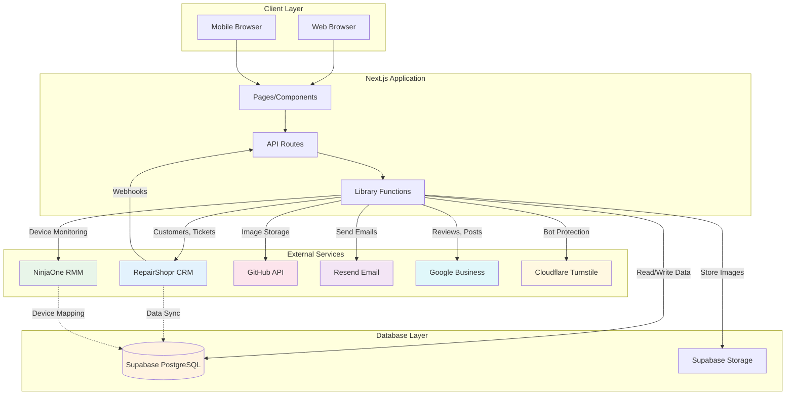

# External Integrations Guide

Comprehensive documentation for all external service integrations in the Computer Store KS application.

---

## Table of Contents

1. [RepairShopr CRM Integration](#1-repairshopr-crm-integration)
2. [NinjaOne RMM Integration](#2-ninjaone-rmm-integration)
3. [Supabase Integration](#3-supabase-integration)
4. [GitHub API Integration](#4-github-api-integration)
5. [Resend Email Integration](#5-resend-email-integration)
6. [Google Business Integration](#6-google-business-integration)
7. [Cloudflare Turnstile Integration](#7-cloudflare-turnstile-integration)
8. [Integration Architecture Diagram](#8-integration-architecture-diagram)
9. [Error Handling](#9-error-handling)
10. [Rate Limits and Quotas](#10-rate-limits-and-quotas)

---

## 1. RepairShopr CRM Integration

RepairShopr is the primary CRM system for customer, ticket, invoice, and asset management.

### Overview

| Attribute | Value |
|-----------|-------|
| **API Base URL** | `https://{subdomain}.repairshopr.com/api/v1` |
| **Authentication** | API Key (query parameter) |
| **Primary Use** | Customer management, ticketing, invoicing |
| **Source Files** | `src/lib/repairshopr.ts`, `src/lib/repairshopr-sync.ts` |

### Authentication

RepairShopr uses API key authentication passed as a query parameter:

```typescript
// API key from environment
const apiToken = process.env.REPAIRSHOPR_API_KEY;

// Usage in requests
const url = `/customers?api_key=${encodeURIComponent(apiToken)}`;
```

**Environment Variables:**
```bash
REPAIRSHOPR_SUBDOMAIN=thecomputerstore
REPAIRSHOPR_API_KEY=your_api_key_here
```

### Endpoints Used

#### Customer Endpoints

| Method | Endpoint | Description |
|--------|----------|-------------|
| `GET` | `/customers` | Search/list customers with pagination |
| `GET` | `/customers/{id}` | Get single customer by ID |
| `POST` | `/customers` | Create new customer |
| `PUT` | `/customers/{id}` | Update existing customer |

#### Ticket Endpoints

| Method | Endpoint | Description |
|--------|----------|-------------|
| `GET` | `/tickets` | Search/list tickets with filters |
| `GET` | `/tickets/{id}` | Get ticket with comments and details |
| `POST` | `/tickets` | Create new ticket |
| `PUT` | `/tickets/{id}` | Update ticket |
| `POST` | `/tickets/{id}/comment` | Add comment to ticket |

#### Asset Endpoints

| Method | Endpoint | Description |
|--------|----------|-------------|
| `GET` | `/customer_assets` | List all assets with pagination |
| `GET` | `/customer_assets?customer_id={id}` | Get assets for specific customer |
| `GET` | `/customer_assets/{id}` | Get single asset |
| `POST` | `/customer_assets` | Create new asset |
| `DELETE` | `/customer_assets/{id}` | Delete asset |

#### Invoice Endpoints

| Method | Endpoint | Description |
|--------|----------|-------------|
| `GET` | `/invoices` | List invoices with pagination |
| `GET` | `/invoices/{id}` | Get invoice with line items |
| `GET` | `/invoices?customer_id={id}` | Get customer invoices |

#### Payment Endpoints

| Method | Endpoint | Description |
|--------|----------|-------------|
| `GET` | `/payments` | List all payments |

#### Authentication Endpoints

| Method | Endpoint | Description |
|--------|----------|-------------|
| `POST` | `/sign_in` | Authenticate user, get API token |
| `GET` | `/me` | Get current user info |

### Data Sync System

The application maintains a local copy of RepairShopr data in Supabase for faster queries and offline capability.

**Sync Strategy:**
1. **Initial sync**: Pull all data from RepairShopr to Supabase
2. **Incremental sync**: Webhooks update data in real-time
3. **Background sync**: Periodic full sync every 24 hours

**Synced Entities:**
- `rs_customers` - Customer records
- `rs_tickets` - Tickets
- `rs_ticket_comments` - Ticket comments
- `rs_assets` - Customer assets/devices
- `rs_invoices` - Invoices
- `rs_payments` - Payments
- `rs_products` - Products/inventory

**Sync Functions:**

```typescript
import {
  syncAllCustomers,
  syncAllTickets,
  syncAllTicketComments,
  syncAllAssets,
  syncAllInvoices,
  syncAllPayments,
  syncAllProducts,
  runFullSync,
  triggerSyncIfNeeded
} from '@/lib/repairshopr-sync';

// Full sync of all entities
const result = await runFullSync();

// Individual entity sync
await syncAllCustomers();

// Auto-sync if stale (>24 hours)
await triggerSyncIfNeeded(24);
```

### Webhook Integration

RepairShopr sends webhooks for real-time data updates.

**Webhook Endpoint:** `POST /api/webhooks/repairshopr`

**Supported Events:**
- Customer: created, updated
- Ticket: created, updated, status changed
- Invoice: created, updated, paid
- Asset: created, updated

**Setup in RepairShopr:**
1. Go to Admin > Notification Center
2. Create a new Notification Set
3. Enter webhook URL: `https://computerstoreks.com/api/webhooks/repairshopr`
4. Enable webhook for desired events

**Security Configuration:**
```bash
# Optional: HMAC-SHA256 signature validation
REPAIRSHOPR_WEBHOOK_SECRET=your_webhook_secret
```

**Webhook Payload Structure:**
```typescript
interface WebhookEvent {
  event_type: string;       // e.g., "customer.created", "ticket.updated"
  customer?: { id: number; ... };
  ticket?: { id: number; ... };
  invoice?: { id: number; ... };
  asset?: { id: number; ... };
}
```

### Protection Plan Tiers

The system maps RepairShopr customer metadata to protection plan tiers:

| Tier | RepairShopr Indicator |
|------|----------------------|
| `silver` | `is_silver_plan`, tags containing "silver" |
| `silver-plus` | Tags/fields containing "gold" (mapped to silver-plus) |
| `eset` | Asset-level ESET status |

```typescript
import { getProtectionPlanTier } from '@/lib/repairshopr';

const tier = getProtectionPlanTier(customer);
// Returns: 'silver' | 'silver-plus' | 'eset' | null
```

---

## 2. NinjaOne RMM Integration

NinjaOne provides remote monitoring and management (RMM) data for customer devices.

### Overview

| Attribute | Value |
|-----------|-------|
| **API Base URL** | `https://app.ninjarmm.com/api/v2` |
| **Authentication** | OAuth 2.0 (Client Credentials) |
| **Primary Use** | Device monitoring, hardware inventory |
| **Source File** | `src/lib/ninjaone.ts` |

### OAuth Authentication

NinjaOne uses OAuth 2.0 client credentials flow:

```typescript
// Token endpoint
const TOKEN_URL = 'https://app.ninjarmm.com/oauth/token';

// Token request
const response = await fetch(TOKEN_URL, {
  method: 'POST',
  headers: { 'Content-Type': 'application/x-www-form-urlencoded' },
  body: new URLSearchParams({
    grant_type: 'client_credentials',
    client_id: process.env.NINJAONE_CLIENT_ID,
    client_secret: process.env.NINJAONE_CLIENT_SECRET,
    scope: 'monitoring management',
  }),
});
```

**Environment Variables:**
```bash
NINJAONE_CLIENT_ID=your_client_id
NINJAONE_CLIENT_SECRET=your_client_secret
```

### Caching Strategy

The integration implements in-memory caching to reduce API calls:

| Cache Type | TTL | Description |
|------------|-----|-------------|
| Device List | 5 minutes | Cached list of all devices |
| Device Detail | 1 minute | Individual device details |
| Organizations | 10 minutes | Organization list |
| Access Token | Token expiry - 5 minutes | OAuth access token |

```typescript
const CACHE_TTL = {
  LIST: 5 * 60 * 1000,      // 5 minutes
  DETAIL: 60 * 1000,        // 1 minute
  ORGS: 10 * 60 * 1000,     // 10 minutes
};
```

### Endpoints Used

| Method | Endpoint | Description |
|--------|----------|-------------|
| `GET` | `/devices` | List all devices with pagination |
| `GET` | `/devices/{id}` | Get device details |
| `GET` | `/devices/{id}/os-patches` | Get OS patch status |
| `GET` | `/devices/{id}/software` | Get installed software |
| `GET` | `/organizations` | List organizations |

### Device Data Model

```typescript
interface NinjaOneDevice {
  id: number;
  systemName: string;
  dnsName: string;
  lastContact: string;
  offline: boolean;
  organizationId: number;
  nodeClass: string;         // WINDOWS_WORKSTATION, MAC, etc.

  // Hardware info
  system: {
    manufacturer: string;
    model: string;
    biosSerialNumber: string;
  };

  // OS info
  os: {
    name: string;
    architecture: string;
    buildNumber: string;
  };

  // Hardware components
  processors: Array<{
    name: string;
    speed: number;
    cores: number;
  }>;

  memory: {
    capacity: number;        // bytes
  };

  volumes: Array<{
    name: string;
    capacity: number;
    freeSpace: number;
  }>;
}
```

### Device Mapping to RepairShopr

Devices are mapped to RepairShopr assets via Supabase:

```typescript
interface DeviceMapping {
  id: string;
  ninjaone_device_id: number;
  repairshopr_asset_id: number;
  repairshopr_customer_id: number;
  device_name: string;
  last_synced: string;
}

// Functions
import {
  getDeviceMapping,
  createDeviceMapping,
  deleteDeviceMapping,
  getDeviceMappingsByCustomer
} from '@/lib/ninjaone';
```

### API Functions

```typescript
import {
  getDevices,           // Get all devices
  getDeviceById,        // Get single device
  getDevicesByCustomer, // Get devices for customer via mapping
  searchDevices,        // Search by name/serial
  getOrganizations,     // List organizations
  refreshCache,         // Force cache refresh
} from '@/lib/ninjaone';

// Example usage
const devices = await getDevices();
const device = await getDeviceById(12345);
const customerDevices = await getDevicesByCustomer(customerId);
```

---

## 3. Supabase Integration

Supabase provides PostgreSQL database, authentication, and storage services.

### Overview

| Attribute | Value |
|-----------|-------|
| **Service** | Supabase (PostgreSQL) |
| **Authentication** | Anon Key (public), Service Role Key (admin) |
| **Primary Use** | Database, file storage, real-time subscriptions |
| **Source File** | `src/lib/supabase.ts` |

### Client Configuration

Two clients are available for different use cases:

```typescript
import { supabase, supabaseAdmin } from '@/lib/supabase';

// Public client (uses anon key, respects RLS)
const { data } = await supabase
  .from('blog_posts')
  .select('*')
  .eq('status', 'published');

// Admin client (bypasses RLS, server-side only)
const { data } = await supabaseAdmin
  .from('blog_posts')
  .select('*');
```

**Environment Variables:**
```bash
NEXT_PUBLIC_SUPABASE_URL=https://xxx.supabase.co
NEXT_PUBLIC_SUPABASE_ANON_KEY=eyJ...
SUPABASE_SERVICE_ROLE_KEY=eyJ...
```

### Database Schema

#### Blog Tables
| Table | Description |
|-------|-------------|
| `blog_posts` | Blog posts with title, content, status |
| `blog_categories` | Post categories |
| `blog_tags` | Post tags |
| `blog_post_tags` | Post-tag junction table |

#### Gallery Tables
| Table | Description |
|-------|-------------|
| `gallery_computers` | Computer inventory |
| `gallery_sales` | Sale configurations |

#### RepairShopr Sync Tables
| Table | Description |
|-------|-------------|
| `rs_customers` | Synced customer data |
| `rs_tickets` | Synced ticket data |
| `rs_ticket_comments` | Synced ticket comments |
| `rs_assets` | Synced asset data |
| `rs_invoices` | Synced invoice data |
| `rs_payments` | Synced payment data |
| `rs_products` | Synced product data |
| `rs_sync_log` | Sync operation logs |

#### Ticket Status Tables
| Table | Description |
|-------|-------------|
| `ticket_status_definitions` | Custom status definitions |
| `ticket_status_overrides` | Per-ticket status overrides |
| `ticket_public_notes` | Public notes for tickets |

#### Protection Plan Tables
| Table | Description |
|-------|-------------|
| `customer_silver_plans` | Customer protection plans |
| `asset_protection_plans` | Asset-level protection plans |

#### Device Mapping Table
| Table | Description |
|-------|-------------|
| `device_mappings` | NinjaOne to RepairShopr device mappings |

### Key Database Functions

```typescript
// Blog operations
import {
  getPublishedPosts,
  getPublishedPostBySlug,
  createPost,
  updatePost,
  deletePost,
} from '@/lib/supabase';

// Gallery operations
import {
  getComputers,
  getComputerById,
  createComputer,
  updateComputer,
  deleteComputer,
  getActiveSale,
  setActiveSale,
} from '@/lib/supabase';

// Ticket status operations
import {
  getTicketStatusOverride,
  setTicketStatusOverride,
  getTicketStatusDefinitions,
} from '@/lib/supabase';

// Protection plan operations
import {
  getCustomerProtectionPlan,
  setCustomerProtectionPlan,
  getAssetProtectionPlan,
  setAssetProtectionPlan,
} from '@/lib/supabase';
```

### Row Level Security (RLS)

Public tables use RLS policies:

```sql
-- Example: Blog posts readable by anyone
CREATE POLICY "Public can read published posts" ON blog_posts
  FOR SELECT USING (status = 'published');

-- Admin tables bypass RLS using service role key
```

### Storage Buckets

| Bucket | Purpose | Access |
|--------|---------|--------|
| `blog-images` | Blog post images | Public read |
| `gallery-images` | Gallery thumbnails | Public read |

---

## 4. GitHub API Integration

GitHub API is used for storing gallery images in the repository.

### Overview

| Attribute | Value |
|-----------|-------|
| **Library** | `@octokit/rest` |
| **Authentication** | Personal Access Token |
| **Primary Use** | Image storage for gallery |
| **Source File** | `src/lib/github.ts` |

### Configuration

```bash
GITHUB_TOKEN=ghp_xxx
GITHUB_OWNER=matthewholman
GITHUB_REPO=Computer_Store_KS
GITHUB_BRANCH=Computer-Store-KS
```

### Available Functions

```typescript
import {
  getFileFromGitHub,      // Read file content
  getFileSha,             // Get file SHA for updates
  updateFileOnGitHub,     // Update existing file
  createFileOnGitHub,     // Create new file
  deleteFileFromGitHub,   // Delete file
  uploadImageToGitHub,    // Upload image with optional path
  isGitHubConfigured,     // Check if configured
} from '@/lib/github';
```

### Image Upload Flow

```typescript
// Upload gallery image
const result = await uploadImageToGitHub(
  'computer-123.jpg',              // filename
  imageBuffer,                      // Buffer
  'Add gallery image',              // commit message
  'public/assets/gallery'           // directory
);

// Returns: { sha, url, path }
```

### API Operations

| Function | GitHub API Method | Description |
|----------|------------------|-------------|
| `getFileFromGitHub` | `repos.getContent` | Read file as base64 |
| `getFileSha` | `repos.getContent` | Get SHA for update |
| `createFileOnGitHub` | `repos.createOrUpdateFileContents` | Create new file |
| `updateFileOnGitHub` | `repos.createOrUpdateFileContents` | Update with SHA |
| `deleteFileFromGitHub` | `repos.deleteFile` | Delete with SHA |

---

## 5. Resend Email Integration

Resend handles transactional email delivery.

### Overview

| Attribute | Value |
|-----------|-------|
| **API URL** | `https://api.resend.com/emails` |
| **Authentication** | Bearer Token |
| **Primary Use** | Contact form notifications |
| **Source File** | `src/lib/email.ts` |

### Configuration

```bash
RESEND_API_KEY=re_xxx
NOTIFICATION_EMAIL=contact@computerstoreks.com
```

### Email Functions

```typescript
import {
  sendEmail,                  // Generic email send
  sendContactNotification,    // Notify business of contact
  sendContactConfirmation,    // Confirm to customer
} from '@/lib/email';

// Send contact notification to business
await sendContactNotification({
  name: 'John Doe',
  email: 'john@example.com',
  phone: '555-1234',
  subject: 'Repair Question',
  message: 'My computer won\'t start...',
});

// Send confirmation to customer
await sendContactConfirmation({
  name: 'John Doe',
  email: 'john@example.com',
  subject: 'Repair Question',
});
```

### Email Templates

The system uses HTML email templates with:
- Responsive design
- Business branding (blue header)
- Contact information footer
- Plain text fallback

### API Request Format

```typescript
const response = await fetch('https://api.resend.com/emails', {
  method: 'POST',
  headers: {
    'Authorization': `Bearer ${RESEND_API_KEY}`,
    'Content-Type': 'application/json',
  },
  body: JSON.stringify({
    from: 'Computer Store Kansas <contact@computerstoreks.com>',
    to: [recipient],
    subject: 'Subject line',
    html: '<html>...</html>',
    text: 'Plain text version',
    reply_to: replyToAddress,
  }),
});
```

---

## 6. Google Business Integration

Google Business Profile API provides reviews, posts, and business information.

### Overview

| Attribute | Value |
|-----------|-------|
| **APIs** | My Business Business Information API, My Business API |
| **Authentication** | OAuth 2.0 (Refresh Token) |
| **Primary Use** | Display reviews and business info |
| **Source File** | `src/lib/google-business.ts` |

### Configuration

```bash
GOOGLE_BUSINESS_CLIENT_ID=xxx.apps.googleusercontent.com
GOOGLE_BUSINESS_CLIENT_SECRET=xxx
GOOGLE_BUSINESS_REFRESH_TOKEN=xxx
GOOGLE_BUSINESS_ACCOUNT_ID=xxx
GOOGLE_BUSINESS_LOCATION_ID=xxx
```

### OAuth Token Refresh

```typescript
// Automatic token refresh using refresh token
const response = await fetch('https://oauth2.googleapis.com/token', {
  method: 'POST',
  headers: { 'Content-Type': 'application/x-www-form-urlencoded' },
  body: new URLSearchParams({
    client_id: GBP_CLIENT_ID,
    client_secret: GBP_CLIENT_SECRET,
    refresh_token: GBP_REFRESH_TOKEN,
    grant_type: 'refresh_token',
  }),
});
```

### Endpoints Used

| API | Endpoint | Description |
|-----|----------|-------------|
| Reviews | `/accounts/{id}/locations/{id}/reviews` | Fetch customer reviews |
| Posts | `/accounts/{id}/locations/{id}/localPosts` | Fetch business posts |
| Business Info | `/locations/{id}` | Get business details |

### Caching

Data is cached for 15 minutes to reduce API calls:

```typescript
const CACHE_DURATION_MS = 15 * 60 * 1000; // 15 minutes

// Cached data types
interface GoogleBusinessCache {
  reviews?: { data: DisplayReview[]; fetchedAt: string; averageRating: number; totalCount: number };
  posts?: { data: DisplayPost[]; fetchedAt: string };
  businessInfo?: { data: DisplayBusinessInfo; fetchedAt: string };
}
```

### Available Functions

```typescript
import {
  fetchReviews,                  // Get customer reviews
  fetchPosts,                    // Get business posts
  fetchBusinessInfo,             // Get business details
  fetchAllGoogleBusinessData,    // Fetch all at once
  getCachedReviewsStats,         // Get cached stats
  clearCache,                    // Clear all cache
  isGoogleBusinessConfigured,    // Check configuration
} from '@/lib/google-business';
```

### Data Models

```typescript
interface DisplayReview {
  id: string;
  authorName: string;
  authorPhoto?: string;
  rating: number;        // 1-5
  text?: string;
  date: string;
  reply?: { text: string; date: string };
}

interface DisplayPost {
  id: string;
  type: 'update' | 'event' | 'offer' | 'alert';
  summary: string;
  date: string;
  imageUrl?: string;
  callToAction?: { type: string; url: string };
  event?: { title: string; startDate: string; endDate: string };
  offer?: { couponCode?: string; url?: string; terms?: string };
}

interface DisplayBusinessInfo {
  name: string;
  phone?: string;
  address?: { street: string; city: string; state: string; zip: string };
  website?: string;
  hours?: Array<{ day: string; open: string; close: string }>;
  mapsUrl?: string;
  reviewUrl?: string;
  coordinates?: { lat: number; lng: number };
}
```

---

## 7. Cloudflare Turnstile Integration

Cloudflare Turnstile provides invisible CAPTCHA for bot protection.

### Overview

| Attribute | Value |
|-----------|-------|
| **Widget Type** | Invisible CAPTCHA |
| **Verification URL** | `https://challenges.cloudflare.com/turnstile/v0/siteverify` |
| **Primary Use** | Contact form bot protection |
| **Source File** | `src/lib/spam-detection.ts` |

### Configuration

```bash
# Client-side (public)
NEXT_PUBLIC_TURNSTILE_SITE_KEY=xxx

# Server-side (secret)
TURNSTILE_SECRET_KEY=xxx
```

### Client-Side Integration

```tsx
// In contact form component
import { Turnstile } from '@marsidev/react-turnstile';

<Turnstile
  siteKey={process.env.NEXT_PUBLIC_TURNSTILE_SITE_KEY}
  onSuccess={(token) => setTurnstileToken(token)}
  options={{ theme: 'light', size: 'invisible' }}
/>
```

### Server-Side Verification

```typescript
import { verifyTurnstile } from '@/lib/spam-detection';

// In API route
const isValid = await verifyTurnstile(turnstileToken, clientIP);

if (!isValid) {
  return NextResponse.json({ error: 'Verification failed' }, { status: 400 });
}
```

### Verification API Call

```typescript
const response = await fetch('https://challenges.cloudflare.com/turnstile/v0/siteverify', {
  method: 'POST',
  headers: { 'Content-Type': 'application/json' },
  body: JSON.stringify({
    secret: TURNSTILE_SECRET_KEY,
    response: token,
    remoteip: clientIP,
  }),
});

const data = await response.json();
// data.success === true if valid
```

### Spam Score Integration

Turnstile is part of the multi-layered spam detection:

```typescript
// Turnstile failure adds 200 points (instant block)
// If Turnstile is configured but token missing: 200 points
// If Turnstile is configured and passes: 0 points

const spamResult = await calculateSpamScore(formData, headers, clientIP);
// spamResult.breakdown.turnstile will be 0 or 200
```

### Spam Score Breakdown

| Signal | Max Points | Description |
|--------|------------|-------------|
| Content | 35 | Entropy, word validity, keyboard walks |
| Patterns | 30 | Spam keywords, links, caps |
| Timing | 20 | Submission speed |
| Honeypot | 50 | Hidden field detection |
| Fingerprint | 15 | Request headers |
| Disposable Email | 25 | Throwaway email detection |
| Interaction | 20 | Behavioral analysis |
| Browser Fingerprint | 10 | Client fingerprint |
| Turnstile | 200 | CAPTCHA verification (pass=0, fail=200) |
| Gibberish | 30 | Random character detection |
| Name Validation | 25 | Suspicious name patterns |

### Action Thresholds

| Score | Action |
|-------|--------|
| 0-49 | Allow |
| 50-79 | Log (suspicious, but allow) |
| 80-119 | Block |
| 120+ | Silent success (fake success) |

---

## 8. Integration Architecture Diagram



### Data Flow Summary

1. **Customer Journey**: Browser -> Next.js -> API Routes -> RepairShopr/Supabase
2. **Contact Form**: Browser -> API -> Turnstile Verification -> Spam Check -> Resend Email
3. **Device Lookup**: Browser -> API -> NinjaOne API (cached) -> Device Mapping in Supabase
4. **Blog/Gallery**: Browser -> API -> Supabase Database/Storage
5. **Webhooks**: RepairShopr -> API Webhook Handler -> Supabase Sync
6. **Reviews**: API -> Google Business API (cached) -> Browser

---

## 9. Error Handling

### RepairShopr Error Handling

```typescript
class RepairShoprAPIError extends Error {
  public readonly status: number;
  public readonly code: string;

  constructor(message: string, status: number, code: string = 'API_ERROR') {
    super(message);
    this.name = 'RepairShoprAPIError';
    this.status = status;
    this.code = code;
  }
}

// Error codes
// - UNAUTHORIZED (401)
// - FORBIDDEN (403)
// - NOT_FOUND (404)
// - VALIDATION_ERROR (422)
// - RATE_LIMIT_EXCEEDED (429)
// - SERVER_ERROR (500-504)
// - NETWORK_ERROR (connection failed)
```

### NinjaOne Error Handling

```typescript
// Retry with exponential backoff
const MAX_RETRY_ATTEMPTS = 3;

async function fetchWithRetry(url: string): Promise<Response> {
  for (let attempt = 0; attempt < MAX_RETRY_ATTEMPTS; attempt++) {
    try {
      const response = await fetch(url, options);
      if (response.ok) return response;

      if (response.status === 429) {
        // Rate limited - wait and retry
        await delay(Math.pow(2, attempt) * 1000);
        continue;
      }

      throw new Error(`HTTP ${response.status}`);
    } catch (error) {
      if (attempt === MAX_RETRY_ATTEMPTS - 1) throw error;
      await delay(Math.pow(2, attempt) * 1000);
    }
  }
}
```

### Supabase Error Handling

```typescript
const { data, error } = await supabase.from('table').select();

if (error) {
  // PGRST116 = no rows found (not an error for single())
  if (error.code === 'PGRST116') {
    return null;
  }
  console.error('Supabase error:', error.message);
  throw error;
}
```

### Email Error Handling

```typescript
interface EmailResult {
  success: boolean;
  id?: string;
  error?: string;
}

// Graceful degradation - log error but don't fail request
if (!result.success) {
  console.error('Email failed:', result.error);
  // Continue processing - don't block user action
}
```

### Webhook Error Handling

```typescript
export async function POST(request: NextRequest) {
  try {
    // Validate signature
    if (!validateSignature(rawBody, signature)) {
      return NextResponse.json({ error: 'Invalid signature' }, { status: 401 });
    }

    // Process webhook
    await processWebhook(event);

    return NextResponse.json({ success: true });
  } catch (error) {
    console.error('[Webhook] Error:', error);
    // Return 500 so RepairShopr knows to retry
    return NextResponse.json({ error: error.message }, { status: 500 });
  }
}
```

---

## 10. Rate Limits and Quotas

### RepairShopr

| Limit | Value | Window |
|-------|-------|--------|
| API Requests | 180 | Per minute |
| Webhook Events | Unlimited | - |

**Client-side tracking:**
```typescript
const RATE_LIMIT_MAX = 180;
const RATE_LIMIT_WINDOW_MS = 60 * 1000;

// Check before each request
if (this.rateLimitState.requestCount >= RATE_LIMIT_MAX) {
  throw new RepairShoprAPIError(
    `Rate limit exceeded. Try again in ${resetMs}ms`,
    429,
    'RATE_LIMIT_EXCEEDED'
  );
}
```

### NinjaOne

| Limit | Value | Notes |
|-------|-------|-------|
| API Requests | 1000 | Per minute (default) |
| Token Lifetime | 3600s | 1 hour, auto-refresh |

**Mitigation:**
- 5-minute cache for device lists
- 1-minute cache for device details
- Exponential backoff on 429 responses

### GitHub

| Limit | Value | Notes |
|-------|-------|-------|
| API Requests | 5000 | Per hour (authenticated) |
| File Size | 100 MB | Per file |

### Resend

| Tier | Daily Limit | Notes |
|------|-------------|-------|
| Free | 100 | Per day |
| Pro | 50,000+ | Per month |

**Current Usage:** Free tier (contact form only)

### Google Business Profile

| Limit | Value | Notes |
|-------|-------|-------|
| API Requests | 1000 | Per day (default) |

**Mitigation:**
- 15-minute cache for all data
- Single fetch for multiple data types

### Cloudflare Turnstile

| Limit | Value | Notes |
|-------|-------|-------|
| Verifications | Unlimited | Free tier |
| Widget Loads | Unlimited | Free tier |

### Supabase (Free Tier)

| Resource | Limit |
|----------|-------|
| Database Size | 500 MB |
| API Requests | Unlimited |
| File Storage | 1 GB |
| Bandwidth | 2 GB |
| Edge Function Invocations | 500,000/month |

---

## Quick Reference: Environment Variables

```bash
# RepairShopr
REPAIRSHOPR_SUBDOMAIN=thecomputerstore
REPAIRSHOPR_API_KEY=xxx
REPAIRSHOPR_WEBHOOK_SECRET=xxx  # Optional

# NinjaOne
NINJAONE_CLIENT_ID=xxx
NINJAONE_CLIENT_SECRET=xxx

# Supabase
NEXT_PUBLIC_SUPABASE_URL=https://xxx.supabase.co
NEXT_PUBLIC_SUPABASE_ANON_KEY=eyJ...
SUPABASE_SERVICE_ROLE_KEY=eyJ...

# GitHub
GITHUB_TOKEN=ghp_xxx
GITHUB_OWNER=matthewholman
GITHUB_REPO=Computer_Store_KS
GITHUB_BRANCH=Computer-Store-KS

# Resend
RESEND_API_KEY=re_xxx
NOTIFICATION_EMAIL=contact@computerstoreks.com

# Google Business
GOOGLE_BUSINESS_CLIENT_ID=xxx
GOOGLE_BUSINESS_CLIENT_SECRET=xxx
GOOGLE_BUSINESS_REFRESH_TOKEN=xxx
GOOGLE_BUSINESS_ACCOUNT_ID=xxx
GOOGLE_BUSINESS_LOCATION_ID=xxx

# Cloudflare Turnstile
NEXT_PUBLIC_TURNSTILE_SITE_KEY=xxx
TURNSTILE_SECRET_KEY=xxx

# Authentication
AUTH_MODE=repairshopr
SESSION_SECRET=<64-hex-chars>
```

---

## Revision History

| Version | Date | Changes |
|---------|------|---------|
| 1.0.0 | 2026-01-12 | Initial comprehensive documentation |
